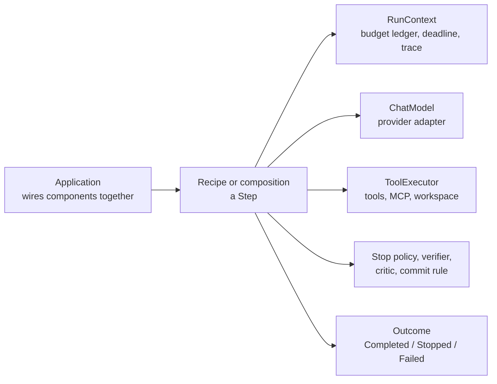

# llmgrid design plan

**Status:** revision 3 (2026-09-24). Phase 0 is done locally; Phase 1 is next.

This plan is the guard rail for llmgrid. When a change conflicts with it, either the change is wrong or the plan needs an explicit revision. Do not let the two drift apart silently.

## llmgrid in one minute

llmgrid is a Python toolkit of typed, composable building blocks for LLM agents. It started life as `llm-port`, a provider abstraction layer, and was re-scoped: providers are now pluggable dependencies, and the product is **honest execution**.

What "honest" means in practice:

- **Every call is paid for.** Each model and tool call is reserved against one shared budget before it runs.
- **Every stop has a reason.** Running out of budget, hitting an iteration cap, making no progress, and being stopped by a critic are all distinct, named outcomes. A partial answer is never passed off as a final one.
- **"Done" must be proven.** A loop completes only when a verifier says so, and the result carries the evidence. The model saying it is finished is a claim that triggers a check.
- **Loops cannot cheat.** The evaluator is out of the agent's reach, every attempt is journalled, and every iteration either commits a verified change or rolls back completely.
- **Everything is traceable.** Every outcome, decision, and artifact can be traced back to the step that produced it, and a run can be replayed offline.

llmgrid is a library, not a framework. It ships the parts and enforces their guarantees; the application chooses the loop pattern, thresholds, prompts, and verifiers.

## How it fits together

Six packages share the `llmgrid` namespace. `llmgrid-interfaces` holds every contract and depends only on the standard library; `network` (providers), `tools`, `context`, `rag`, and `loops` each depend only on interfaces, never on each other. The application combines them.

## Chapters

| Chapter | What it covers | Read it if you want to know |
| --- | --- | --- |
| [1. Vision and scope](plan/01-vision-and-scope.md) | Why llmgrid exists, its principles, non-goals, and scope | What llmgrid is and is not trying to be |
| [2. Decisions](plan/02-decisions.md) | The decision log (D-01 to D-30), deferred decisions, and open questions (Q-01 to Q-17) | Why something is the way it is, or what is still undecided |
| [3. Packages and repository](plan/03-packages.md) | Repository layout, dependency rules, versioning, Make targets, what each package owns, provider adapters | Where code belongs and which providers are supported |
| [4. Interfaces](plan/04-interfaces.md) | Every contract and value type, traceability, debuggability, SOLID, and how packages prove conformance | The exact shape of the API |
| [5. Runtime behaviour](plan/05-runtime.md) | Run context, deadlines, budget accounting, failures and cancellation, retries, observability, approval | How execution behaves at run time |
| [6. Loop control](plan/06-loop-control.md) | Stopping, no-progress detection, verified completion, the critic, evaluator protection, the journal, transactional iterations, context hygiene | How loops stop, complete, and stay honest |
| [7. Recipes and patterns](plan/07-recipes-and-patterns.md) | Composition primitives, five recipes, and common patterns (ReAct, Reflexion, the Ralph loop, and more) | How to build an agent from the parts |
| [8. Extending llmgrid](plan/08-extending.md) | Checklists for adding providers, tools, MCP servers, stop policies, verifiers, critics, and recipes | How to add your own component |
| [9. Roadmap](plan/09-roadmap.md) | Phases 0 to 7 with exit gates, the hardening checklist, and migration from llm-port | What is done and what comes next |
| [10. Testing and release](plan/10-testing-and-release.md) | Test matrix, packaging, and the checklist for every change | How changes are tested and shipped |
| [Appendix: starter code](plan/appendix-starter-code.md) | The validated prototype that seeded the packages | Where the current code came from |

## Suggested reading paths

- **New to the project:** this page, then chapters 1, 3, and 7.
- **Implementing Phase 1:** chapters 4 and 5, then the Phase 1 section of chapter 9.
- **Adding a provider or tool:** chapter 3 (provider adapters), chapter 4 (tools), then chapter 8.
- **Designing an agent loop:** chapters 6 and 7.
- **Reviewing a change:** the decision log in chapter 2 and the checklist in chapter 10.

## Glossary

| Term | Meaning |
| --- | --- |
| **Step** | Anything that takes a typed input and a `RunContext` and returns a typed output. Recipes and compositions are steps |
| **Recipe** | A ready-made composition of steps, such as the tool-calling agent. Recipes nest inside each other |
| **Composition root** | The place in an application where concrete components are constructed and wired together |
| **RunContext** | What every step receives: run identity, trace position, budget ledger, deadline, event sink, clock, and ID source |
| **Ledger** | The shared budget. Calls reserve against it before running; children get narrower limits, never wider |
| **Leaf dispatch** | One model call or one tool call. Only leaf dispatches reserve budget and open a timeout scope |
| **Outcome** | How a loop ended: `Completed` (verified), `Stopped` (with a reason), `Failed`, or `Suspended` |
| **Stop policy** | A pure rule deciding whether a loop continues, such as "at most 50 iterations" |
| **Progress signal** | A pure measurement of whether a loop is getting anywhere, such as "the metric has not improved in 8 iterations" |
| **Verifier** | The only thing that can certify a result as complete. Deterministic (tests, metrics), judged (an independent model or human), or self-report (only by explicit opt-in) |
| **Evaluator** | Gives feedback on a draft so it can be revised. Unlike a verifier, it does not certify |
| **Critic** | A model-backed reviewer that watches a loop's trajectory and can guide it or stop it |
| **Workspace** | Files the agent may change, with snapshot, commit, rollback, and protected paths |
| **Commit rule** | A pure rule deciding whether an iteration's change is kept, such as "only if the metric improved" |
| **Experiment journal** | The append-only record of every attempt in an iterative loop |
| **Artifact store** | Where large tool outputs go instead of the model's context; the model sees a handle and a preview |
| **Compaction** | Shrinking a long history to fit the context window, as a budgeted, visible step |
| **Provider state** | Opaque data a provider needs back on the next turn (for example reasoning blocks); carried, never inspected |
| **TraceRef** | A record's position in the run's span tree: run ID, span ID, parent span, and a readable step path |
| **Decision record** | A record of who made a decision, what they decided, why, and on what inputs |

## Revision history

- **Revision 1.** The first version of this plan.
- **Revision 2 (2026-09-23).** The pivot from `llm-port` (a provider abstraction layer) to `llmgrid` (a composable agent toolkit). It kept every rule from revision 1, renamed the project (D-01), added the decisions a review surfaced (D-11 and D-13 to D-20), replaced the migration section with an inventory of the actual checkout, re-validated the starter code, and was amended for separate distributions per package.
- **Revision 3 (2026-09-24).** Fixed the first-party provider adapter set, with Bedrock planned and no gateway adapter (D-21). Added loop control (D-22 to D-29): customisable stopping, certified completion, no-progress detection, a critic with binding authority, context hygiene (compaction, offloading, sub-agents), tool side-effect and error contracts, evaluator protection, an experiment journal, and transactional iterations. Added traceability and debuggability to the interfaces (D-30), the full interface specification, Recipe 5, and the loop-patterns table. The single long document was then split into the chapters above for readability, with no rules removed.

## References

- [Python protocol specification](https://typing.python.org/en/latest/spec/protocol.html): structural typing and protocol compatibility.
- [Python protocols guide](https://typing.python.org/en/latest/reference/protocols.html): practical protocol usage.
- [Dependency injection](https://www.martinfowler.com/articles/injection.html): separating configuration and composition from implementation.
- [import-linter](https://import-linter.readthedocs.io/): enforcing import contracts between packages.
- [Model Context Protocol](https://modelcontextprotocol.io/): tool and resource interoperability.
- [OpenTelemetry semantic conventions for generative AI](https://opentelemetry.io/docs/specs/semconv/gen-ai/): span and attribute naming.

The package boundaries, milestone order, and execution policies in this plan are the project's own design recommendations, not requirements imposed by these references.
