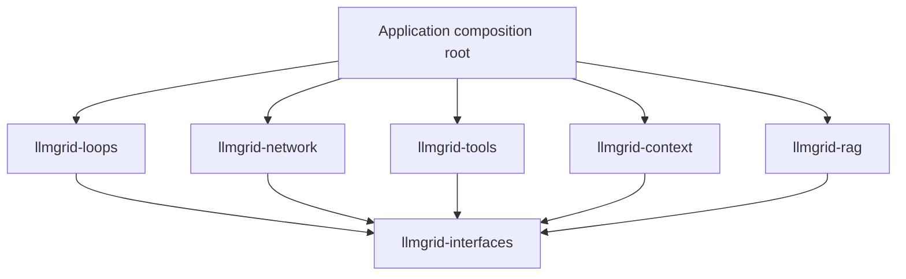

# llmgrid: composable agent platform — architecture, implementation plan, and starter code

Status: revision 2, amended for separate distributions. Phase 0 done locally. Date: 2026-09-23.

Revision 2 records the pivot from `llm-port` (a provider abstraction layer) to `llmgrid` (a composable agent toolkit). It keeps every rule from revision 1, adds the decisions that the review surfaced, and replaces the migration section with an inventory of the actual checkout. The starter code in Section 14 has been re-validated (see Section 14 for exactly what was run).

This document is the guard rail for the pivot. When a change conflicts with it, either the change is wrong or this document needs an explicit revision. Do not let the two drift silently.

## Contents

1. Pivot, positioning, and non-goals
2. Objective and architectural decisions
3. Repository and dependency structure
4. Package responsibilities
5. Contracts and data ownership
6. Execution semantics
7. Composition and standard recipes
8. SOLID rules and extension workflow
9. Migration from the llm-port checkout
10. Implementation phases and acceptance gates
11. Testing, packaging, and release process
12. Decisions to defer
13. Open questions
14. Runnable starter implementation
15. Production hardening checklist
16. References

## 1. Pivot, positioning, and non-goals

### What changed

`llm-port` was scoped as a provider abstraction layer: one API across many providers, with reliable tool calling. Its value was breadth. `llmgrid` is scoped as a toolkit of typed, composable agent building blocks. Its value is **honest execution semantics**. Providers become pluggable dependencies instead of the product.

### Core bet

> Typed, composable agent building blocks with explicit budgets, cancellation, and outcomes — no hidden loops, no silent fallbacks.

Every scope decision should trace back to this sentence. If a feature cannot be delivered without a hidden loop, an unaccounted model call, or a silent downgrade, it is either redesigned or rejected.

### What llmgrid should be better at than the alternatives

The ecosystem already contains provider gateways (for example LiteLLM), vendor agent SDKs, and agent frameworks (for example pydantic-ai and LangGraph). llmgrid does not try to out-feature them. It competes on properties that are hard to retrofit:

| Property | Concretely |
| --- | --- |
| Explicit accounting | Every model and tool dispatch is reserved against one shared ledger, including repair attempts |
| Explicit outcomes | Budget exhaustion, truncation, refusal, and round limits are distinct results, never a relabelled partial answer |
| Structural, not inherited, contracts | Third parties implement protocols; no base classes to inherit |
| Typed composition | Incompatible step connections fail static type checking |
| Weak/local model reliability | Syntactic tool-call recovery for models that emit calls as text, inherited from the llm-port work |
| Honest effect semantics | Correlated tool results; later, a journal that surfaces `outcome_unknown` instead of replaying |

### Non-goals

- Breadth of first-party provider adapters. Ship a small tested set (Section 4) and offer a gateway adapter for breadth.
- A graph DSL, YAML workflows, or a visual builder.
- A hosted service, scheduler, or vector database.
- Prompt libraries or domain-specific agents inside the runtime.
- Hiding async. A sync facade exists (Decision D-11), but the core is async.

### Interoperate rather than reinvent

- **MCP** as the primary third-party tool source (Section 7, Recipe 4).
- **OpenTelemetry GenAI semantic conventions** for trace and event attribute names (Section 6).
- **A gateway adapter** (for example over LiteLLM) as an optional extra for provider breadth, clearly labelled as inheriting the gateway's semantics and limits.

## 2. Objective and architectural decisions

Build a collection of typed capabilities that developers can use directly or compose into agent workflows. Ship useful recipes without requiring applications to adopt a universal agent abstraction.

The core promise is: an application can replace a conforming component or introduce a new composition without modifying existing runtime code.

"Any agentic use case" means an open extension path. It does not mean every workflow can be expressed by configuration, that every provider supports every feature, or that every block can connect to every other block.

### Decision log

Each decision gets an ID so code reviews and ADRs in `docs/decisions/` can cite it. Revision 2 changes are marked **(r2)**.

| ID | Decision | Rationale | Verification |
| --- | --- | --- | --- |
| D-01 | **(r2)** Project name `llmgrid`: distribution `llmgrid`, import `llmgrid` | Available on PyPI (checked 2026-09-23); avoids the crowded `llm-*` plugin namespace; the name no longer implies a provider port | `pip download llmgrid` returns nothing before first publish |
| D-02 | **(r2, amended)** Separate distributions (`llmgrid-interfaces`, `-network`, `-tools`, `-context`, `-rag`, `-loops`) sharing the `llmgrid` namespace package, plus an `llmgrid` meta-package | Each package can be developed, versioned, and published on its own; consumers install only what they need. Cost: coordinated version ranges and per-package release order | `tests/architecture` enforces the dependency graph; `make smoke` installs every wheel into a clean environment |
| D-03 | `llmgrid.interfaces` is the canonical contracts package and is standard-library only | Contracts must install and import without any SDK | The architecture test rejects any non-stdlib import in interfaces |
| D-04 | Capability protocols plus a generic execution protocol | Preserve semantic meaning while supporting composition | Direct capability use requires no loop runtime |
| D-05 | Async-first APIs | Model and tool operations are predominantly I/O | Cancellation and timeout tests |
| D-06 | Typed inputs and outputs | Make incompatible connections visible | Static negative tests reject invalid sequences |
| D-07 | Explicit constructor injection | Make dependencies discoverable | No global service registry in interfaces or loops |
| D-08 | Runtime-owned execution semantics | Make nested compositions predictable | Shared budget and cancellation tests |
| D-09 | Recipes are ordinary compositions or steps | Applications can replace or embed them | Execute a recipe inside another sequence |
| D-10 | Minimal mandatory dependencies; SDKs and databases are extras | Avoid pulling SDKs into every install | Inspect wheel dependency metadata |
| D-11 | **(r2)** Sync access through one explicit facade, `llmgrid.sync.run(step, value, context)`, which refuses to run inside an active event loop | Many users are sync; duplicating every protocol in sync form doubles the contract surface | Test that the facade raises inside a running loop |
| D-12 | Explicit capability validation | Avoid silent feature degradation | Unsupported requests fail before provider execution |
| D-13 | **(r2)** Assistant messages carry opaque, provider-owned continuation state (`ProviderState`) | Reasoning/thinking blocks and similar data must be returned to some providers unchanged during tool loops; a text-only message cannot represent them | Adapter contract test: state emitted on turn N appears unchanged in request N+1 |
| D-14 | **(r2)** Portable request options are typed first-class fields; provider-specific options travel in typed, adapter-keyed option objects | Without an escape hatch the portable request becomes the lowest common denominator and users bypass it | Adapter tests for accepted, foreign, and malformed options |
| D-15 | **(r2)** Tool-call arguments are carried as raw JSON text (`arguments_json`); decoding belongs to the tool binding | Undecodable arguments must still reach the loop so the model can be told what was wrong | Malformed-argument test returns a correlated error result |
| D-16 | **(r2)** Provider adapters do syntactic recovery only; semantic correction always flows through the loop | Prevents a hidden second feedback loop and unaccounted model calls inside the adapter | Adapter tests prove one `generate` call equals at most one provider attempt per transport retry policy, and no corrective model calls |
| D-17 | **(r2)** Usage fields are `int \| None`; `None` means unknown | Zero and unknown are different facts | Contract test on adapters that omit usage |
| D-18 | **(r2)** Normalized finish reasons: `stop`, `tool_calls`, `length`, `content_filter`, `refusal`. Errors are exceptions, not a finish reason | One vocabulary across adapters; an error is not a way of finishing | Adapter mapping tables and tests per provider |
| D-19 | **(r2)** No library exception shadows a builtin name | The existing `errors.TimeoutError` shadows the builtin raised by `asyncio.timeout` | Ruff `A` rules stay enabled without per-line suppressions |
| D-20 | **(r2)** Event and trace attributes follow OpenTelemetry GenAI semantic conventions where a convention exists | Avoid inventing a schema that every consumer must map | Event schema review against the convention version pinned in the ADR |

### Initial supported scope

- Text messages, normalized tool calls, and opaque provider continuation state (D-13).
- Async model generation.
- Typed tools with explicit decoding and encoding.
- Sequence composition and a bounded tool-calling recipe.
- In-process run limits, deadlines, and cooperative cancellation.
- Scripted models and tools for offline development.
- **(r2)** Two first-party adapters: Anthropic, and the OpenAI-compatible wire format (which also covers Ollama, vLLM, LM Studio, llama.cpp, and TGI). Gemini is the third candidate.

### Target scope after the foundation is proven

- Typed branches, bounded repetition, and parallel execution.
- Retrieval, context construction, memory, and evaluation.
- **(r2)** Structured output as a capability and a step (Section 5).
- **(r2)** MCP tool sources.
- Streaming as a separate capability.
- Human approval with suspension and resumption.
- Durable checkpoints and side-effect recovery.
- Optional integration extras, including a gateway adapter for provider breadth.

Do not advertise durable execution, exactly-once effects, multimodal support, or arbitrary JSON Schema validation based on the starter code.

## 3. Repository and dependency structure

**(r2, amended)** Revision 2 first proposed one distribution with internal subpackages. The owner chose separate distributions instead, so each package can be worked on, versioned, and published on its own (D-02). They share the implicit namespace package `llmgrid` (PEP 420): `pip install llmgrid-tools` provides `import llmgrid.tools`. The `llmgrid` distribution is a meta-package that installs all of them. An architecture test enforces the boundaries.

Implemented layout (Phase 0 and the Section 14 prototype):

```text
llmgrid/                             # repository: github.com/sanketn26/llmgrid
├── pyproject.toml                   # workspace tool config only (ruff, mypy, pytest); not a distribution
├── requirements-dev.txt             # shared dev tooling
├── Makefile                         # all-package and per-package targets, publishing
├── packages/
│   ├── interfaces/                  # dist llmgrid-interfaces -> llmgrid.interfaces; stdlib only
│   │   ├── pyproject.toml, README.md, LICENSE
│   │   ├── src/llmgrid/interfaces/  # errors, values, model, tools, execution
│   │   └── tests/
│   ├── network/                     # dist llmgrid-network -> llmgrid.network; ChatModel adapters
│   ├── tools/                       # dist llmgrid-tools -> llmgrid.tools
│   ├── context/                     # dist llmgrid-context -> llmgrid.context (planned)
│   ├── rag/                         # dist llmgrid-rag -> llmgrid.rag (planned)
│   ├── loops/                       # dist llmgrid-loops -> llmgrid.loops
│   └── llmgrid/                     # dist llmgrid: meta-package, no code
├── tests/
│   ├── architecture/                # dependency rules between packages
│   ├── integration/                 # offline flows across packages
│   ├── typing/                      # compositions that must fail type checking
│   └── live/                        # opt-in, credentials required (Phase 2)
├── examples/tool_agent/
├── legacy/llm_port/                 # pre-pivot code, reference only; not built or checked
└── docs/
```

No distribution ships `src/llmgrid/__init__.py`; doing so would break the shared namespace. The architecture test checks this.

Intended growth inside each package (create modules when their first implementation lands; this is ownership, not a list of empty files to create):

```text
network/src/llmgrid/network/   anthropic/, openai_compat/, recovery/ (D-16), capabilities/, serializers/
tools/src/llmgrid/tools/       binding.py, registry.py, mcp/ (extra), builtins/
context/src/llmgrid/context/   assembly/, memory/
rag/src/llmgrid/rag/           retrievers/, evidence.py, grounded_answer.py
loops/src/llmgrid/loops/       composition.py, model_step.py, tool_agent.py, sync.py (D-11)
tests/                         contracts/ (adapter conformance suites)
examples/                      grounded_answer/, draft_review/, mcp_agent/
```

### Dependency rules



- `llmgrid-interfaces`: standard library only.
- `llmgrid-network`: interfaces; `httpx` and provider SDKs are extras (`llmgrid-network[anthropic]`, `llmgrid-network[openai]`).
- `llmgrid-tools`: interfaces; integration clients are extras (`llmgrid-tools[mcp]`).
- `llmgrid-context`: interfaces; storage clients are extras.
- `llmgrid-rag`: interfaces; vector-store and embedding clients are extras.
- `llmgrid-loops`: interfaces only. Concrete tools, memory implementations, and model adapters are supplied by the application.
- Sibling packages never import each other. Only applications, `examples/`, and `tests/integration` combine them. A package's own tests use fakes built on interfaces.
- A summarizer in `llmgrid.context` accepts `ChatModel`; it does not construct a provider client.
- Keep basic `RunContext`, `Step`, and execution error contracts in interfaces so tools do not import loops.
- Importing any package must not import an optional SDK. SDK imports happen inside the adapter module that needs them.

`tests/architecture/test_dependencies.py` enforces these rules without extra tooling. It parses every source file and fails if a package imports a sibling or a third-party module, if a package imports an llmgrid package it does not declare in its `pyproject.toml`, or if any package ships `llmgrid/__init__.py`. When the first optional SDK lands, extend it to allow that SDK only inside its adapter module, or adopt import-linter if the rules outgrow the test.

`make smoke` installs every built wheel into a clean virtualenv and imports each package, which proves the published artifacts work without the workspace.

Use ordinary Python constructor calls as the composition root. Start without automatic plugin discovery, decorators with registration side effects, or a dependency injection container.

### Versioning

- All packages start at `0.1.0a1` and move together while contracts churn.
- Internal dependencies use a compatible range, for example `llmgrid-interfaces>=0.1.0a1,<0.2`, never an exact pin. A range that includes a prerelease admits prereleases.
- Publish `llmgrid-interfaces` first, then the packages that depend on it, then the `llmgrid` meta-package.
- A breaking change to interfaces bumps the minor version of interfaces and the upper bound in every dependent package in the same change.
- Once interfaces stabilizes, packages may version independently.

### Make targets

| Target | Scope |
| --- | --- |
| `setup` | One `.venv` with every package installed editable plus dev tooling |
| `check`, `lint`, `typecheck`, `test`, `build`, `smoke`, `demo` | All packages |
| `check-<pkg>`, `lint-<pkg>`, `typecheck-<pkg>`, `test-<pkg>`, `build-<pkg>` | One package |
| `publish-<pkg>` | Refuses unless on `main` with a clean tree; runs `check-<pkg>`, builds, `twine check --strict`, uploads. `REPOSITORY=testpypi` targets TestPyPI |
| `packages` | Lists package directories, distribution names, and versions |

## 4. Package responsibilities

### `llmgrid.interfaces`

Own portable value types, capability protocols, execution contracts, and normalized public errors. Include a contract only when a real consumer requires it. Document semantics adjacent to each protocol.

Do not include provider names, transport clients, database handles, prompt templates, model catalogues, or recipe implementations.

### `llmgrid.network`

Own provider configuration, SDK lifecycle, serialization, transport retries, normalized model responses, model capability discovery/configuration, and syntactic tool-call recovery.

Move provider-specific schema conversion into serializers. A shared `ToolSpec` must not gain a new method whenever a provider is added.

Expose actual attempt and usage information for transport attempts where available. A request with internal retries must not appear to cost exactly one successful call if that hides known usage.

**(r2) Recovery boundary (D-16).** Adapters may:

- extract tool calls that a model emitted as text (`origin="recovered"`);
- fix mechanically broken JSON (trailing commas, code fences, single quotes) when the fix is unambiguous;
- normalize provider-specific finish reasons and tool-call shapes.

Adapters must not call the model again to correct arguments, and must not validate arguments against a tool's semantic schema. When arguments are wrong, the call reaches the loop, the binding's decoder rejects it, and the model receives a correlated error result. That correction is visible in history and charged to the ledger.

If a later profile shows that in-adapter corrective retries are materially better for weak models, reintroduce them only as an explicit, opt-in `Step` in `llmgrid.loops` that reserves budget for every attempt. It must not return from `generate`.

**(r2) First-party adapter set.** Anthropic and OpenAI-compatible first; Gemini third. Every other provider arrives through the OpenAI-compatible adapter, a community adapter that passes the contract suite, or the gateway extra.

### `llmgrid.tools`

Own typed tool bindings, schema/codec association, duplicate-name validation, dispatch, MCP tool sources, and concrete reusable tools. A registry validates and routes a call; the runtime controls ordering, scheduling, and whether a call is authorized to proceed.

Avoid a separate tool-execution engine competing with the loop runtime. Execution middleware can wrap the tool executor through the same contract.

### `llmgrid.context`

Own conversation-store implementations, long-term memory implementations, summarizers, and context builders.

### `llmgrid.rag`

**(r2, amended)** Own retrieval: retriever adapters, rerankers, the `Evidence` type's implementations, and the grounded-answer recipe's retrieval and citation-validation steps. Split from context because retrieval brings the heaviest optional dependencies (vector stores, embedding clients). The `Retriever` protocol itself lives in interfaces, so context builders can accept evidence without importing rag.

Keep retrieval and generation separate. A retriever returns evidence; a context builder selects and renders evidence; a model generates an answer.

### `llmgrid.loops`

Own composition primitives, run orchestration, lifecycle events, stopping, approval suspension, checkpoints, standard recipes, and the sync facade.

Prompts, allowed tools, domain output schemas, and success criteria are application inputs or injected policies. Do not add branches such as `if use_case == "support"` to the runtime.

## 5. Contracts and data ownership

### Two layers of interfaces

Semantic capabilities describe what an operation means:

```text
ChatModel.generate(ChatRequest) -> ChatResponse
Tool[I, O].invoke(I) -> O
Retriever.retrieve(RetrievalQuery) -> RetrievalResult
MemoryReader.recall(MemoryQuery) -> tuple[MemoryRecord, ...]
MemoryWriter.remember(RememberCommand) -> MemoryReceipt
Evaluator[T].evaluate(T) -> Evaluation
ContextBuilder.build(ContextRequest) -> ContextBundle
```

The execution contract describes how a block participates in a composition:

```text
Step[A, B].run(A, context=RunContext) -> B
Sequence(Step[A, B], Step[B, C]) -> Step[A, C]
```

Adapters connect the two. Do not force all useful capabilities to depend on orchestration. A direct retriever call should be a normal supported use case.

### Value-type design rules

1. Use concrete domain types instead of shared mutable bags of state.
2. Use tuples for ordered immutable collections where practical.
3. Frozen dataclasses are shallowly immutable. Copy or freeze nested structures at boundaries; do not assume `frozen=True` protects dictionaries.
4. Separate model messages from response metadata such as usage and finish reason.
5. Preserve tool-call IDs end to end. Never synthesize a different result ID.
6. Represent missing usage as unknown, not zero. Estimated usage must be distinguishable from measured usage.
7. Keep provider raw payloads out of portable results by default. Expose diagnostic payloads separately with an explicit retention policy.
8. Use discriminated variants for outcomes whose fields differ; avoid many unrelated optional fields.
9. Make domain identifiers and serialization versions explicit before persistent checkpoints ship.
10. JSON validation is a runtime boundary. Python type annotations do not validate incoming model arguments.
11. **(r2)** Opaque provider continuation state is not a raw payload. It is data the provider requires back, so it lives on the message (D-13), while diagnostic raw payloads stay out (rule 7).
12. **(r2)** No library exception class shadows a builtin name (D-19).

### (r2) Message shape

```text
Message
  role: system | user | assistant | tool
  text: str
  calls: tuple[ToolCall, ...]              # assistant only
  result: ToolResult | None                # tool only, exactly one
  provider_state: tuple[ProviderState, ...]  # assistant only; opaque

ToolCall
  id: str                                  # nonempty, unique per run
  name: str
  arguments_json: str                      # raw text after syntactic recovery (D-15)
  origin: native | recovered

ProviderState
  provider: str                            # adapter-defined key, e.g. "anthropic"
  payload_json: str                        # opaque to everything except that adapter
```

Rules for `ProviderState`:

- The runtime and context builders carry it unchanged and never inspect it.
- An adapter serializes only state whose `provider` key is its own, and ignores other keys. This behavior is documented, not silent: switching providers mid-conversation drops the other provider's continuation, and the adapter's documentation says what that costs (for example, loss of prior reasoning context).
- A context builder that trims history must keep an assistant message's `provider_state` with that message, and must never keep tool calls while dropping the state the provider requires alongside them.
- Checkpoints persist it verbatim.
- Phase 2 must verify the current round-trip requirements for each first-party provider (at the time of writing: Anthropic thinking blocks with signatures during tool use, Gemini thought signatures, and OpenAI Responses reasoning items). Record the findings in the adapter's ADR rather than trusting this list.

A convenience accessor `ToolCall.parsed_arguments()` may parse the JSON and raise `InvalidArgumentsError`. It does not validate against a schema.

### (r2) Request options (D-14)

```text
ChatRequest
  messages: tuple[Message, ...]
  tools: tuple[ToolSpec, ...]
  max_output_tokens: int | None
  temperature: float | None
  tool_choice: auto | none | required | ToolName | None
  response_format: JsonSchemaFormat | None
  provider_options: tuple[ProviderOptions, ...]
```

- Portable fields are validated against `ModelCapabilities` before dispatch (D-12). An unsupported portable field fails; it is not dropped.
- `ProviderOptions` is a protocol with a `provider` key. Each adapter defines its own frozen options type, for example `AnthropicOptions(thinking_budget_tokens=..., cache_breakpoints=...)`.
- An adapter consumes options with its own key, rejects malformed options for itself, and ignores options for other providers. One request may therefore carry options for several providers, which keeps fallback compositions possible.
- Adapters never accept untyped `extra_body` dictionaries through the portable request. A raw-body escape hatch, if kept, lives on the adapter's constructor, where it is clearly provider-specific.

### (r2) Finish reasons (D-18)

| Normalized | Meaning | Adapter obligation |
| --- | --- | --- |
| `stop` | Natural completion | Must have no tool calls |
| `tool_calls` | Model requested tools | Must have at least one complete tool call. Providers that report `stop` alongside tool calls are normalized to `tool_calls` |
| `length` | Output limit reached | Partial tool calls are discarded and never executed. The partial text may be reported, but the recipe treats it as non-completion |
| `content_filter` | Provider safety system stopped output | Distinct from a model refusal |
| `refusal` | The model declined | Only when the provider reports it structurally |

Unknown provider reasons raise a normalized `ProviderProtocolError` carrying the raw reason, rather than being mapped to a guess. Transport and API failures are exceptions, never a finish reason.

### (r2) Structured output

- `ModelCapabilities.structured_output: native | prompted | none`.
- `ChatRequest.response_format` carries the schema declaration.
- A `StructuredStep[T]` in `llmgrid.loops` pairs a declaration with a decoder, exactly like a tool binding, and returns `T` or a typed decode failure.
- `prompted` mode is allowed only when the application opts in, because it is a weaker guarantee.
- Decoding failures are explicit outcomes. A bounded re-ask is a `Repeat` composition that consumes budget, never an adapter-internal loop (D-16).

### Contract catalogue

| Contract | Minimum values | Required guarantees |
| --- | --- | --- |
| `ChatModel` | Request, response, capabilities | Explicit finish reason; normalized failures; no tool execution; no corrective model calls (D-16); provider state round-trips (D-13) |
| `StreamingChatModel` | Typed delta/event union | Defined event ordering; one terminal event; cancellation closes resources; the final assembled response equals what `generate` would return |
| `Tool[I, O]` | Input/output types and context | Declared effect behavior; validated input; no swallowed cancellation |
| `ToolExecutor` | ToolCall, ToolResult | Correlation preserved; unknown names handled explicitly |
| `Retriever` | Query, filters, scoped request, evidence | Source provenance; defined ordering and score meaning |
| `MemoryReader` | Scope and query | Scope isolation; documented visibility/consistency |
| `MemoryWriter` | Scoped records and operation ID | Documented deduplication, retention, and write acknowledgement |
| `ContextBuilder` | History, evidence, model budget | Fits declared input budget or fails explicitly; preserves message/tool integrity and provider state |
| `Evaluator[T]` | Candidate, evaluation | Explicit accepted/revise/rejected semantics; feedback available when needed |
| `CheckpointStore` | Snapshot and expected revision | Atomic compare-and-swap; versioned serialization |
| `EventSink` | Versioned run events | Documented ordering and observer-failure policy |

These are target contracts. The runnable starter implements only a subset.

**(r2) Streaming shape decision, made now, built later.** `StreamingChatModel` is a separate protocol, not an optional method on `ChatModel`. An adapter implementing both must pass a contract test showing the assembled stream equals the non-streamed response for the same scripted input. This is decided in Phase 1 because it shapes `ChatModel`, even though streaming ships in Phase 5.

### Keep five forms of state distinct

| State | Example | Expected lifetime |
| --- | --- | --- |
| Conversation | User/model messages, tool results, provider continuation state | Session |
| Long-term memory | Persisted user preference | Across sessions |
| Evidence | Retrieved document passages with source IDs | Usually one query/run |
| Assembled model context | Selected messages and evidence within a token budget | One model invocation |
| Execution checkpoint | Pending call, completed steps, budget ledger, approval status | Until completion/expiry |

They may share storage infrastructure. They must not become one `Memory` interface.

### JSON schemas and typed tools

Each registered tool binds four things: a declaration, a decoder, a typed implementation, and an encoder. The decoder and declaration must agree on required fields, unknown-field policy, nullability, numeric handling, and constraints.

For the starter, use explicit decoders for small schemas. Later choose one maintained validation/schema system and define the supported JSON Schema dialect. Do not grow a partial homemade schema validator and imply it implements the standard.

**(r2)** The existing `ArgSpec` type checks in `src/llm_port/spec/tools.py` are exactly such a partial validator. Keep them only as an internal helper for rendering prompted-tool instructions until the schema library decision (Open question Q-03) is made. Do not expose them as validation.

Provider schema restrictions belong in serializers. If a provider cannot express a requirement, preserve local validation and either reject the provider configuration or expose the documented approximation. Never silently claim stronger guarantees than the adapter delivers.

### (r2) Error taxonomy

Carry the useful parts of the existing `errors.py` into `llmgrid.interfaces.errors`, renamed so nothing shadows a builtin (D-19):

| Family | Examples | Raised by |
| --- | --- | --- |
| `ContractError` | Invalid message shape, correlation mismatch, reused call ID | Core values, runtime |
| `ConfigurationError` | Missing credentials, unsupported capability requested | Adapters, runtime pre-dispatch validation |
| `ProviderError` | `AuthenticationError`, `RateLimitError`, `ServerError`, `ContextLengthError`, `ProviderTimeoutError`, `ProviderProtocolError` | Adapters |
| `BudgetExceededError`, `ModelStoppedError` | Ledger exhaustion, non-completion | Runtime (prototype only; replaced by outcomes, Section 6) |
| `InvalidArgumentsError` | Decoder rejection | Tool bindings, converted to correlated error results |

`ProviderTimeoutError` subclasses both `ProviderError` and the builtin `TimeoutError`, so `except TimeoutError` still catches it. Run-deadline expiry raises the builtin `TimeoutError` from `asyncio.timeout`.

## 6. Execution semantics

### Run context

Carry run identity, deadline, cancellation, and a shared budget ledger. Later add trace identity and an event sink. Do not use context as a lookup container for arbitrary services or mutable application data.

Nested steps share the same ledger and cancellation source. Child scopes may narrow deadlines and budgets; they must not reset or enlarge parent limits. A child failure does not refund already consumed external work.

### (r2) Deadline ownership

- Only leaf dispatches (a model call or a tool call issued by the runtime) open a timeout scope, through `RunContext.invoke`.
- Composition primitives and capabilities call `RunContext.check()` between operations. They do not open nested timeout scopes.
- Direct users of a capability outside the runtime (for example calling `ToolRegistry.execute` directly) own their own timeout policy.
- `loop.time()` deadlines are process-local. Phase 6 checkpoints store a wall-clock deadline and convert it on resume.

### Resource accounting

Track model requests, actual provider attempts where observable, tool invocations, input/output tokens, elapsed time, and optionally cost. Define each counter precisely.

- Check and reserve limits before dispatch.
- Settle known usage after completion.
- Failed/timeout attempts can still incur cost; do not automatically refund them.
- Uncertain provider usage remains unknown in the ledger.
- Parallel reservations require atomic updates in the owning runtime.
- Hard monetary limits require conservative reservations and provider support; post-response accounting alone cannot enforce them.
- **(r2)** Transport retries inside an adapter are reported back as attempts on the response metadata and settled against the ledger. The reservation is for one logical model request; the attempt counter records what actually happened.

The starter enforces logical model/tool invocation counts and a monotonic deadline. It does not enforce token or monetary limits and does not observe internal provider retries.

### (r2) Hierarchical ledger

The prototype `Budget` is flat. Before it moves into `llmgrid.interfaces`, replace it with a ledger that supports narrowed child scopes:

```text
Ledger
  limits: Limits                     # this scope's own caps
  parent: Ledger | None
  used: Counters

  reserve(kind, amount=1):
      check this scope and every ancestor; fail if any would exceed
      then increment this scope and every ancestor
  child(limits) -> Ledger             # limits may only be <= remaining in every ancestor

RunContext.child(*, deadline=None, limits=None) -> RunContext
  deadline = min(parent.deadline, deadline)
  ledger   = parent.ledger.child(limits)
  same cancellation source and run identity; new span identity
```

- Reservation is check-all-then-increment-all with no `await` in between, which is atomic within one event loop. Thread-safe or cross-process ledgers are a Phase 5 and Phase 6 concern.
- A child's unused allowance is not returned to siblings; it simply remains unused in the parent.
- Tests: a child cannot exceed the parent; two children share the parent's cap; a child with a larger requested limit is clamped or rejected (decide which in the ADR; rejecting is the safer default).

### Failures and cancellation

| Situation | Behavior |
| --- | --- |
| Tool argument decoding fails | Return a correlated tool-error result so a model may correct the call |
| Tool name does not exist | Return a correlated tool-error result |
| Expected domain tool failure | Explicit domain error result, according to the tool contract |
| Unexpected programming/infrastructure error | Propagate; do not disguise it as successful completion |
| Parent cancellation | Propagate cancellation; close streams and owned resources |
| Budget exhaustion | Explicit stopped/failed run outcome; never pretend partial text is a final answer |
| Model truncation/refusal/content filter | Explicit outcome or typed exception, according to recipe contract |
| Unknown provider finish reason | `ProviderProtocolError` with the raw reason |
| Observer failure | Default best-effort telemetry; durable audit must have a separate explicit policy |

Do not catch `BaseException` in normal error conversion. Do not convert cancellation into a tool error that encourages further model calls.

### Retry versus repeat

- Retry repeats a failed operation under a specific retry policy.
- Repeat advances a workflow using a previous result or feedback.
- Transport retries belong to the provider adapter.
- **(r2)** Corrective re-asks (bad tool arguments, undecodable structured output) are repeats, not retries. They belong to the loop and consume budget (D-16).
- Tool retries require declared idempotency or a supported idempotency key.
- Never automatically retry an entire tool-agent iteration after one tool has succeeded.
- Document the maximum attempts at each layer to avoid multiplied retry counts.

### (r2) Observability

- Events are versioned dataclasses emitted to an injected `EventSink`.
- Span and attribute names follow the OpenTelemetry GenAI semantic conventions where a convention exists (D-20). Pin the convention version in the ADR, because those conventions are still evolving.
- An optional `llmgrid-loops[otel]` extra provides an `EventSink` that emits OpenTelemetry spans. Interfaces has no OpenTelemetry dependency.
- Redaction is a policy on the sink, not the runtime. Message text, tool arguments, and provider state are excluded by default and included only by explicit configuration.

### Approval and durable effects: later milestone

Represent a run outcome as `Completed[T] | Suspended | Failed | Stopped`, using data variants with appropriate fields.

An approval-required tool call should produce a suspension record containing the exact call, argument digest, approver scope, and checkpoint revision. Resumption verifies that approval matches that call and revision. Approval does not authorize a different call generated later.

Before durable tools ship, implement an execution journal:

```text
proposed -> authorized -> dispatched -> succeeded / failed / outcome_unknown
```

Store the operation ID before dispatch. Record the result after dispatch. A crash between the external effect and result persistence creates `outcome_unknown`; reconcile using the provider's idempotency/status API or require application intervention. A checkpoint cannot by itself guarantee exactly-once external effects.

In-process coroutine cancellation cannot undo a completed external write. Thread-backed synchronous adapters also cannot reliably stop already-running synchronous work. Document both limits.

## 7. Composition and standard recipes

### Primitive rollout order

| Primitive | Shape | Rule |
| --- | --- | --- |
| Sequence | `A -> B -> C` | Output of the first step must satisfy input of the next |
| Branch | `A -> B`, selected among compatible branches | Exhaustive routing or explicit unmatched outcome |
| Repeat | `S -> S` until predicate | Mandatory bound; preserve state and budget |
| Parallel pair | `A -> (B, C)` | Structured concurrency; shared limits; defined sibling-cancellation behavior |
| Map | `tuple[A, ...] -> tuple[B, ...]` | Bounded concurrency; preserve documented ordering |
| Retry wrapper | `A -> B` | Explicit retryable failures and replay-safety policy |

Do not initially create a graph DSL, YAML workflow format, dynamic expression language, or distributed scheduler. Implement Python compositions first. Persisting arbitrary Python callables is not a durable-workflow strategy.

**(r2) Typing note.** mypy rejects an incompatible `SequenceStep`, but when the type parameters are inferred the error reads "cannot infer value of type parameter" rather than naming the mismatched types. Examples and docs should spell out type parameters on non-trivial compositions, and a `then()` builder method is worth evaluating for better error messages.

### Recipe 1: bounded tool-calling agent

1. Validate model capabilities and configured tools.
2. Build a request from current history and tool declarations.
3. Reserve a model invocation and call the model.
4. Inspect the finish reason; stop, refusal, content filter, and truncation are distinct.
5. For tool calls, record the assistant message first, including its provider state.
6. Validate IDs and execute calls under the tool budget.
7. Append correlated tool results in the documented order.
8. Repeat until final answer or a limit/outcome interrupts execution.

Start with sequential tools. Parallel tool execution requires independence and effect policies; multiple model tool calls alone do not establish those conditions.

**(r2)** Required inputs before this recipe is public: an explicit instructions (system) input, and a typed conversation-continuation input instead of a bare string.

### Recipe 2: grounded answer

```text
Question -> Retrieve -> Select/render evidence -> Generate -> Validate citations
```

Define `Evidence` with source ID, content, locator, metadata, and optional score with score-kind information. Define `GroundedAnswer` with answer text and references to supplied source IDs. Decide whether no evidence results in abstention or a clearly marked ungrounded answer; make it policy, not a hidden fallback.

Context assembly must reserve output tokens and overhead, preserve mandatory instructions, and avoid splitting assistant tool calls from their results or from their provider state. A token estimator is an injected capability with documented accuracy.

**(r2)** Citation extraction uses the structured-output step, so `GroundedAnswer` is decoded, not regex-parsed.

### Recipe 3: draft and review

```text
Task -> Draft -> Evaluate -> Accepted / Rejected / Revise -> bounded repeat
```

Use a typed state carrying the original task, current draft, feedback, and iteration. Exhaustion returns an explicit unaccepted result or stop outcome. It does not relabel the latest draft as accepted.

### (r2) Recipe 4: MCP-backed tool agent

```text
MCP server(s) -> McpToolSource -> ToolExecutor -> Recipe 1
```

This is the real-world proof of the `Tool`/`ToolExecutor` contract, because the tools are written by third parties.

- `McpToolSource` lists a server's tools and produces bindings whose declaration is the MCP input schema, whose decoder is JSON parsing plus validation with the chosen schema library (Q-03), and whose output is the MCP result rendered to `ToolResult`.
- Tool names are namespaced per server (for example `server.tool`) so two servers cannot collide; duplicates are still rejected.
- MCP tool annotations such as read-only, destructive, or idempotent hints are **untrusted** unless the application marks that server as trusted. Effect policy, approval, and retry decisions must not rely on hints from an untrusted server.
- Server lifecycle (connect, list, close) is owned by the application's composition root through an async context manager, not by the runtime.
- The MCP SDK is an extra (`llmgrid-tools[mcp]`) and is imported only inside `llmgrid.tools.mcp`.

### Recipe composability test

A recipe must itself satisfy `Step[I, O]`. Embed the grounded-answer recipe in a review workflow without modifying either runtime. This is the concrete test for hierarchical composition.

## 8. SOLID rules and extension workflow

| Principle | Enforced design rule | Failure smell |
| --- | --- | --- |
| SRP | Separate provider conversion, control flow, context selection, and tools | One agent class handles HTTP, prompts, persistence, and scheduling |
| OCP | Add implementations through contracts and constructor injection | Every new integration edits the runtime switch statement |
| LSP | Specify observable semantics and run shared contract tests | Same signature, different correlation/error/cancellation behavior |
| ISP | Split streaming, writing memory, retrieval, and generation capabilities | Implementations fill required methods with `NotImplementedError` |
| DIP | Runtime and implementations depend on portable interfaces | Loops import a concrete SDK or vector database |

OCP does not prohibit fixing or versioning a contract. It means routine extensions should not require broad edits to unrelated implementations.

### Adding a provider

- Implement generation and only the extra capabilities actually supported.
- Translate requests/results through provider serializers.
- Normalize errors, finish reasons (D-18), and usage (D-17) accurately.
- Round-trip provider continuation state (D-13) and define the adapter's `ProviderOptions` type (D-14).
- Perform syntactic recovery only (D-16).
- Declare capabilities conservatively; unknown does not imply supported.
- Run the shared model contract suite plus provider-specific serialization tests against recorded fixtures.
- Configure the adapter in the application; no loop edits.

### Adding a tool

- Define input/output types and matching schema/codec.
- Declare side-effect and idempotency behavior.
- Inject dependencies such as clients and credentials into its constructor.
- Register a binding; reject duplicate names.
- Test malformed arguments, cancellation, and representative results.
- No provider or runtime edits.

### (r2) Adding an MCP server

- Construct an `McpToolSource` in the composition root and include it in the executor.
- Choose a namespace and a trust level.
- Configure approval policy for tools whose effects are unknown.
- No provider or runtime edits.

### Adding a recipe

- Define its input, state, final output, and non-completion outcomes.
- Compose existing primitives or implement a `Step` directly.
- Inject the capabilities it needs.
- Specify stopping and side-effect behavior.
- Demonstrate nesting inside another workflow.
- Extract a new primitive only when its semantics are independently useful.

## 9. Migration from the llm-port checkout

### (r2) Inventory as of 2026-09-23

Branch `optional_providers`. Measured, not assumed:

| Item | State |
| --- | --- |
| Source | About 1,100 lines: `types.py`, `config.py`, `errors.py`, `tools.py`, `spec/tools.py`, `spec/models.py` (untracked) |
| Client and provider adapters | Absent. `LLMClient`, which the README documents, does not exist |
| Tests | `tests/unit` and `tests/integration` exist and are empty |
| README | Claims a "settled" public surface, 18 providers, streaming, and tool-call repair; none are implemented |
| PyPI | `llm-port` has never been published (PyPI returned 404). There are no external users to migrate |
| Duplicated `ToolSpec` | `tools.py` (with `from_callable` and `to_openai`/`to_anthropic`/`to_gemini`) and `spec/tools.py` (with `ArgSpec`, `to_wire`, instruction rendering) |
| `ModelSpec` | Useful capability fields (`ToolSupport` none/prompted/native/strict, `structured_output`, `reasoning`, context limits); couples to `config.Provider` |
| `LLMConfig` | Contains `tool_repair_attempts`, a hidden corrective loop that conflicts with D-16 |
| `errors.py` | Reasonable taxonomy; `TimeoutError` shadows the builtin (conflicts with D-19) |

### (r2) Existing types versus the new contracts

| Existing | New contract | Action |
| --- | --- | --- |
| `ToolCall.arguments: dict` | `arguments_json: str` (D-15) | Change; keep `origin: native/recovered` |
| `Message.content` | `Message.text` | Rename |
| `Message.finish_reason`, `usage`, `raw` on the message | Metadata on `ChatResponse`; no raw payload (rules 4 and 7) | Move; drop `raw` |
| No continuation field | `Message.provider_state` (D-13) | Add |
| `Message.name` | Not in the portable contract | Drop unless a provider needs it, then carry it in provider state |
| `Usage` fields default to `0` | `int \| None` (D-17) | Change; keep `cached_input_tokens` |
| `FinishReason` includes `content_filter`, `error` | D-18 vocabulary; errors are exceptions | Drop `error`; add `refusal` |
| `StreamEvent` with a `kind` string and optional fields | Discriminated event union (rule 8) | Redesign in Phase 5 |
| `Message.coerce` from dicts | Not in interfaces | Move to an optional convenience helper, or drop |
| `errors.TimeoutError` | `ProviderTimeoutError` (D-19) | Rename |
| `ModelSpec` / `ModelRegistry` / `ToolSupport` | `ModelCapabilities` in interfaces; catalogue in `llmgrid.network.capabilities` | Split; remove the `config` import from the capability type |
| `LLMConfig` | Adapter constructor arguments | Split per adapter; drop `tool_repair_attempts`; keep `RetryPolicy` |
| `ToolSpec` ×2 | One declaration type in interfaces; serializers in network | Consolidate |
| `ToolSpec.from_callable` | Candidate helper in `llmgrid.tools` | Keep only if it produces a binding with a matching decoder |
| `Provider` enum with 18 base URLs | OpenAI-compatible adapter takes a `base_url`; presets are optional | Shrink to presets for the first-party adapters |

### Migration sequence

Because nothing was published, there is no compatibility facade work. Breaking changes are made directly.

1. [x] Preserve the working tree. The old code, including uncommitted edits, moved to `legacy/llm_port/`.
2. [x] Rewrite the README to describe llmgrid honestly.
3. [x] Adopt the Section 3 layout with per-package distributions, the architecture test, and per-package Make targets.
4. [x] Land the Section 14 prototype in `interfaces`, `network` (`ScriptedModel`), `tools`, and `loops`, with tests. The tables above are not yet applied beyond the prototype.
5. Consolidate the two `ToolSpec`s into the interfaces declaration. Move provider rendering into network serializers. Keep `ArgSpec` rendering only for prompted-tool instructions.
6. Split `ModelSpec` into interfaces `ModelCapabilities` and a provider-side catalogue.
7. Build the shared model contract suite (the scripted model exists).
8. Build the first real adapter against that suite (Phase 2).
9. Add the runtime and first recipe (Phase 3).

Avoid combining the repository move, public type redesign, and adapter implementation in one commit. Each stage should be reviewable and independently testable.

### Repository and naming follow-ups

- [x] Rename the GitHub repository to `llmgrid` (done 2026-09-23: `github.com/sanketn26/llmgrid`; the old `llm-port` URL redirects). The badge and `project.urls` now point to it; they previously named the wrong account (`sanketnaik`).
- [ ] Publish `0.1.0a1` of all seven distributions with `make publish-<pkg>` after merging to `main` (interfaces first, `llmgrid` last). `llmgrid-context` and `llmgrid-rag` contain no functionality yet, so under PEP 541 they are the most exposed to a name claim; give them real code early.
- [ ] Rename the local checkout directory from `llm-port` (optional; nothing depends on it).
- Check that no other package already installs a top-level `llmgrid` module.

## 10. Implementation phases and acceptance gates

Treat each phase as a milestone with a concrete exit gate. Do not advance because files exist; advance because the behavior is demonstrated.

### Phase 0 — Baseline, rename, and decisions

- [x] Preserve the working tree and record the inventory in Section 9.
- [x] Run existing lint/type/test/build commands and record the baseline. (The old checkout had no tests to run.)
- [x] Rewrite the README for llmgrid.
- [x] Rename to `llmgrid`, adopt the Section 3 layout, and add the architecture test.
- [ ] Write ADRs for D-01 to D-20 (short ones are fine; the point is traceability).
- [ ] List supported initial model/message/tool semantics.

Exit gate: an accurate inventory, a README that matches the code, a green CI run on `main`, and the architecture test passing. (Locally green on 2026-09-23; CI pending the merge.)

### Phase 1 — Minimal contracts

- [ ] Create `llmgrid.interfaces` with `py.typed`.
- [ ] Define JSON values, messages (with provider state), tool calls/results, requests with portable and provider options, responses, usage, finish reasons, and errors.
- [ ] Add `ChatModel`, `StreamingChatModel` (shape only), `Tool`, `ToolExecutor`, `Step`, and execution-context contracts.
- [ ] Implement the hierarchical ledger and `RunContext.child`.
- [ ] Document correlation, ownership, unknown usage, cancellation, and deadline-ownership rules.
- [ ] Add a scripted model and one deterministic typed tool in test fixtures.
- [ ] Add static negative typing tests and shared behavioral tests.

Exit gate: a third-party implementation satisfies the protocols without inheriting framework classes; `llmgrid.interfaces` imports with no dependencies installed.

### Phase 2 — Provider boundary

- [ ] Consolidate tool specifications and migrate serialization.
- [ ] Introduce model capability checks.
- [ ] Implement the Anthropic adapter and the OpenAI-compatible adapter.
- [ ] Verify and document each adapter's provider-state round-trip requirements.
- [ ] Implement syntactic tool-call recovery for the OpenAI-compatible adapter against local-model fixtures.
- [ ] Test finish-reason mapping, usage accounting, and option handling at the boundary.
- [ ] Prove no tool is executed and no corrective model call is made inside an adapter.

Exit gate: scripted and real adapters pass the same model contract suite; offline tests cover the actual wire conversion using recorded fixtures; one opt-in live test per adapter completes a tool round trip.

### Phase 3 — Runtime and first vertical slice

- [ ] Implement sequence composition and model-step adaptation.
- [ ] Implement shared invocation budgets, deadline, and cancellation using the Phase 1 ledger.
- [ ] Implement typed tool binding and registry.
- [ ] Implement the bounded sequential tool-agent recipe with instructions and conversation-continuation inputs.
- [ ] Return explicit outcomes; stop on non-completion.
- [ ] Add the sync facade.
- [ ] Add an offline runnable example and a live example.

Exit gate: the complete tool-call/result/final-answer cycle works offline, including malformed calls and budget exhaustion, without importing a provider SDK, and the same code runs against a real model with only the adapter changed.

### Phase 4 — Prove composition across four recipes

- [ ] Implement retrieval/evidence/context contracts and in-memory implementations.
- [ ] Implement the structured-output step.
- [ ] Implement the grounded-answer recipe and citation validation.
- [ ] Implement the evaluator and draft/review recipe.
- [ ] Implement `McpToolSource` and the MCP agent example.
- [ ] Add branch and bounded repeat only as required by those recipes.
- [ ] Compose a recipe inside another recipe with the same context.
- [ ] Demonstrate replacement of model/retriever/tool without runtime edits.

Exit gate: all four use cases share primitives and have no domain-specific branches in the runtime; an MCP server written by someone else works through the unchanged tool-agent recipe.

### Phase 5 — Observability, streaming, and concurrency

- [ ] Define versioned events and trace parent/child IDs aligned with D-20.
- [ ] Define text/tool/usage/terminal streaming variants and ordering.
- [ ] Make stream closure and backpressure explicit.
- [ ] Add bounded parallel composition with structured cancellation.
- [ ] Make shared reservations concurrency-safe.
- [ ] Define tool independence/effect requirements before parallel tool dispatch.

Exit gate: cancellation leaves no orphan tasks/resources; parallel consumers cannot bypass parent limits; incomplete streamed arguments never reach tool execution.

### Phase 6 — Approval and durability

- [ ] Add discriminated completed/suspended/failed/stopped outcomes.
- [ ] Define versioned serializable checkpoints and stable step IDs.
- [ ] Add atomic checkpoint revision checks.
- [ ] Persist pending effects and operation IDs before dispatch.
- [ ] Tie approvals to exact requests and revisions.
- [ ] Implement outcome-unknown recovery and reconciliation.
- [ ] Test crashes at each effect/checkpoint boundary.

Exit gate: restart/resume preserves intent and completed work; ambiguous external effects are surfaced rather than silently replayed.

### Phase 7 — Release and ecosystem

- [ ] Build the distribution and inspect dependency metadata and extras.
- [ ] Test clean-environment installation from the wheel, with and without each extra.
- [ ] Publish a tested compatibility matrix.
- [ ] Include four working examples and a third-party extension guide.
- [ ] Publish supported Python versions.
- [ ] Document guarantees and known limits before calling the API stable.

Exit gate: users can install only the extras they need and complete each example from the published artifact.

## 11. Testing, packaging, and release process

### Test matrix

| Layer | Required cases |
| --- | --- |
| Static typing | Valid sequence; incompatible sequence rejected; input/output variance; protocol conformance |
| Model contract | Finish reason consistency; tool IDs; unsupported capabilities; unknown usage; cancellation; provider-state round trip; foreign provider options ignored; no corrective calls |
| Tool contract | Bad JSON; bad fields/types; duplicate names; unknown tool; correlation; unexpected failure |
| Runtime | Nested shared budget; child scope cannot exceed parent; boundary exhaustion; zero/expired deadline; parent cancellation; no hidden retry |
| Context | Scope isolation; evidence provenance; no dangling tool messages; provider state kept with its message; budget overflow |
| MCP | Namespacing; duplicate rejection; untrusted hints ignored; server lifecycle closes on cancellation |
| Durable execution | Crash before/after dispatch; duplicate resume; stale approval; stale checkpoint; outcome unknown |
| Architecture | Import-linter contracts; no SDK imported without its extra |
| Packaging | Wheel install; `py.typed`; each extra; no forbidden imports |

Use deterministic fakes for offline tests. Record provider wire fixtures for adapter tests. Live-provider tests are opt-in and should verify integration behavior rather than assert exact generated prose.

Negative typing tests use `# type: ignore[code]` on lines that must fail, with mypy's `warn_unused_ignores` (enabled by `strict`). If a line stops failing, the unused ignore fails the build. Section 14 includes an example.

Run lint, static typing, offline tests, and wheel builds on supported Python versions, initially 3.12 and the newest stable release, with explicitly selected CI versions. Test minimum and current supported dependency sets where compatibility is promised.

### Packaging template

Each package has its own `pyproject.toml`. Example for tools:

```toml
[build-system]
requires = ["hatchling>=1.27"]
build-backend = "hatchling.build"

[project]
name = "llmgrid-tools"
version = "0.1.0a1"
description = "Typed tool bindings and dispatch for llmgrid"
readme = "README.md"
requires-python = ">=3.12"
license = "MIT"
license-files = ["LICENSE"]
dependencies = ["llmgrid-interfaces>=0.1.0a1,<0.2"]

[project.optional-dependencies]
mcp = ["mcp>=1.0"]          # when llmgrid.tools.mcp lands

[tool.hatch.build.targets.wheel]
# `llmgrid` is a namespace package shared by every distribution: no llmgrid/__init__.py.
packages = ["src/llmgrid"]
```

Planned extras: `llmgrid-network[anthropic]`, `llmgrid-network[openai]` (each bringing `httpx`), `llmgrid-tools[mcp]`, `llmgrid-loops[otel]`. Verify every version floor when the extra is implemented; the numbers are placeholders. Each package copies the repository `LICENSE` so it ships in the sdist and wheel.

Whether `httpx` is a hard dependency of `llmgrid-network` or only of its extras is open (Q-05).

Do not require a specific workspace manager to consume the packages. The Makefile uses a plain virtualenv and pip; `make build` and `make smoke` are the packaging truth.

### Review checklist for each change

- Does this introduce a new dependency edge? Does the architecture test still pass?
- Is every new interface required by a concrete consumer?
- Are behavioral guarantees documented and tested?
- Does a nested composition inherit cancellation and resource limits?
- Does any code path call a model or tool without a ledger reservation?
- Are expected domain errors distinguishable from implementation defects?
- Does the public schema match the runtime decoder?
- Does the example run from the installed package?
- Does this change a decision in Section 2? If so, update the decision log and ADR in the same change.

## 12. Decisions to defer

| Defer | Revisit when |
| --- | --- |
| Merging packages back into one distribution | Coordinated releases prove more costly than the independence is worth |
| A standalone composition/runtime distribution | Non-LLM consumers actually use it independently |
| Dynamic plugin discovery | Explicit registration becomes demonstrably burdensome |
| YAML/JSON workflow definitions | External authoring and versioned serialization are required |
| Distributed scheduling | A measured workload requires multiple workers |
| Automatic model routing and fallback | Applications establish routing, fallback, and budget semantics |
| Broad multimodal message hierarchy | At least two adapters and one use case validate the design |
| In-adapter corrective retries | Profiling on weak models shows loop-level correction is materially worse (D-16) |
| Gateway adapter for provider breadth | The two first-party adapters pass the contract suite |
| Universal memory abstraction | Do not add one; preserve separate storage/query responsibilities |

## 13. Open questions

Resolve each in an ADR before the phase that needs it.

| ID | Question | Needed by | Current leaning |
| --- | --- | --- | --- |
| Q-01 | Budget child limit larger than the parent's remaining: clamp or reject? | Phase 1 | Reject |
| Q-02 | Should `ChatResponse` carry `Usage` and attempt count directly, or through a separate `ResponseMetadata`? | Phase 1 | Separate metadata object on the response |
| Q-03 | Which schema/validation library backs decoders and MCP tools (for example `jsonschema`, `msgspec`, or pydantic), and which JSON Schema dialect is supported? | Phase 3 | Undecided; must be an extra, not an interfaces dependency |
| Q-04 | Is `ToolResult.content` text only, or a typed content union (text, JSON, file reference)? | Phase 3 | Text only until MCP forces the question in Phase 4 |
| Q-05 | Is `httpx` a hard dependency of `llmgrid-network` or only of its extras? | Phase 2 | Extra |
| Q-06 | How does an application express provider fallback without automatic routing? | Phase 4 | A plain composition step that catches specific `ProviderError`s and charges both attempts |
| Q-07 | Does the tool-agent recipe expose history-trimming, or require an injected `ContextBuilder`? | Phase 3 | Injected `ContextBuilder` with a default no-trim implementation |
| Q-08 | Which OpenTelemetry GenAI convention version to pin? | Phase 5 | Latest stable at Phase 5 start |

## 14. Runnable starter implementation

This prototype is Python 3.12+ source using standard-library dependencies only. It is presented as four implementation/example files, one test file, and one negative typing file to make the first experiment easy. **(r2, amended)** This has now been done: the definitions live in the packages listed in the table at the end of this section. The flat files below remain as the validated reference.

**(r2) Validation performed on 2026-09-23.** All six Python blocks were extracted from this document into an isolated directory and checked with:

- `python3 demo.py`: produced the expected output (Python 3.14.7).
- `python3 -m unittest test_starter.py`: all 11 tests passed (Python 3.14.7).
- `mypy` 2.3.1 in strict mode with `python_version = "3.12"`: no issues across all six files.
- `ruff` 0.16.8 with this repository's lint rule selection and line length: all checks passed; `ruff format --check`: already formatted.
- The negative typing file was confirmed to fail when an ignore is removed.

Not yet verified: execution on a Python 3.12 interpreter (only type-checked against 3.12), and distribution builds. Both remain Phase 0 gates.

**(r2) Changes from revision 1.** Exceptions renamed with an `Error` suffix (ruff N818). `lambda` in the tool loop replaced with `functools.partial` (ruff B023, loop-variable capture). Timeout scopes opened only at leaf dispatch (Section 6). `ProviderState` and `ToolCall.origin` added (D-13, D-15). `FinishReason` extended with `content_filter` (D-18). Tests added for provider-state round trip, per-call correlation within a batch, and provider state on non-assistant messages.

Create an isolated directory and copy the following blocks into files with the indicated names. Do not overwrite existing package modules with these prototype types.

### File: `contracts.py`

```python
from __future__ import annotations

import asyncio
from collections.abc import Awaitable, Callable
from dataclasses import dataclass, field
from typing import Literal, Protocol


class ContractError(ValueError):
    pass


class BudgetExceededError(RuntimeError):
    pass


class InvalidArgumentsError(ValueError):
    pass


class ModelStoppedError(RuntimeError):
    pass


type FinishReason = Literal["stop", "tool_calls", "length", "content_filter", "refusal"]


@dataclass(frozen=True)
class ToolSpec:
    name: str
    description: str
    # Immutable wire boundary. A binding owns the matching runtime decoder.
    input_schema_json: str


@dataclass(frozen=True)
class ToolCall:
    id: str
    name: str
    # Raw argument text as emitted (after syntactic recovery). Decoding is the
    # binding's job, so undecodable input can still be reported to the model.
    arguments_json: str
    origin: Literal["native", "recovered"] = "native"


@dataclass(frozen=True)
class ToolResult:
    call_id: str
    content: str
    is_error: bool = False


@dataclass(frozen=True)
class ProviderState:
    """Opaque continuation data an adapter must receive back unchanged.

    Examples: reasoning/thinking blocks and their signatures. The runtime
    carries it and never inspects it. Adapters ignore state whose `provider`
    is not their own.
    """

    provider: str
    payload_json: str


@dataclass(frozen=True)
class Message:
    role: Literal["system", "user", "assistant", "tool"]
    text: str = ""
    calls: tuple[ToolCall, ...] = ()
    result: ToolResult | None = None
    provider_state: tuple[ProviderState, ...] = ()

    def __post_init__(self) -> None:
        if self.calls and self.role != "assistant":
            raise ContractError("Only assistant messages may contain calls")
        if self.provider_state and self.role != "assistant":
            raise ContractError("Only assistant messages may carry provider state")
        if (self.role == "tool") != (self.result is not None):
            raise ContractError("Tool messages require exactly one result")
        if self.role == "tool" and self.text:
            raise ContractError("Tool content belongs in result.content")


@dataclass(frozen=True)
class ChatRequest:
    messages: tuple[Message, ...]
    tools: tuple[ToolSpec, ...] = ()


@dataclass(frozen=True)
class ChatResponse:
    message: Message
    finish: FinishReason

    def __post_init__(self) -> None:
        if self.message.role != "assistant":
            raise ContractError("Model response must be an assistant message")
        if (self.finish == "tool_calls") != bool(self.message.calls):
            raise ContractError("Finish reason and tool calls disagree")
        ids = [call.id for call in self.message.calls]
        if any(not value for value in ids) or len(ids) != len(set(ids)):
            raise ContractError("Tool-call IDs must be nonempty and unique")


@dataclass(frozen=True)
class ModelCapabilities:
    tool_calling: bool = False


@dataclass
class Budget:
    max_model_calls: int = 8
    max_tool_calls: int = 16
    model_calls: int = field(default=0, init=False)
    tool_calls: int = field(default=0, init=False)

    def __post_init__(self) -> None:
        if self.max_model_calls < 0 or self.max_tool_calls < 0:
            raise ValueError("Limits must be nonnegative")

    def consume(self, kind: Literal["model", "tool"]) -> None:
        # No await here: atomic within this prototype's single event loop.
        # Not a thread-safe or distributed reservation implementation.
        if kind == "model":
            if self.model_calls >= self.max_model_calls:
                raise BudgetExceededError("Model-call limit reached")
            self.model_calls += 1
        else:
            if self.tool_calls >= self.max_tool_calls:
                raise BudgetExceededError("Tool-call limit reached")
            self.tool_calls += 1


@dataclass(frozen=True)
class RunContext:
    run_id: str
    budget: Budget
    # Use asyncio.get_running_loop().time(), not a wall-clock timestamp.
    deadline: float | None = None

    def check(self) -> None:
        if self.deadline is not None and asyncio.get_running_loop().time() >= self.deadline:
            raise TimeoutError("Run deadline exceeded")

    async def invoke[T](self, operation: Callable[[], Awaitable[T]]) -> T:
        """Dispatch one leaf operation (model or tool call) under the deadline.

        Only the runtime calls this. Composition primitives and capabilities
        call `check()` so a single timeout scope owns each external call.
        """
        self.check()
        async with asyncio.timeout_at(self.deadline):
            return await operation()


class ChatModel(Protocol):
    @property
    def capabilities(self) -> ModelCapabilities: ...

    async def generate(self, request: ChatRequest, *, context: RunContext) -> ChatResponse: ...


class Tool[InputT, OutputT](Protocol):
    async def invoke(self, value: InputT, *, context: RunContext) -> OutputT: ...


class ToolExecutor(Protocol):
    @property
    def specs(self) -> tuple[ToolSpec, ...]: ...

    async def execute(self, call: ToolCall, *, context: RunContext) -> ToolResult: ...


class Step[InputT, OutputT](Protocol):
    async def run(self, value: InputT, *, context: RunContext) -> OutputT: ...
```

The schema and argument strings keep nested mutable JSON out of this minimal contract. A production implementation can expose a validated immutable JSON representation instead. Do not infer that string storage itself validates JSON. Usage, request options, structured outputs, and streaming are intentionally absent here. `Budget` is the flat prototype; Section 6 describes the hierarchical ledger that replaces it.

### File: `tooling.py`

```python
from __future__ import annotations

from collections.abc import Callable, Sequence
from dataclasses import dataclass
from typing import Protocol

from contracts import InvalidArgumentsError, RunContext, Tool, ToolCall, ToolResult, ToolSpec


class BoundTool(Protocol):
    @property
    def spec(self) -> ToolSpec: ...

    async def execute(self, call: ToolCall, *, context: RunContext) -> ToolResult: ...


@dataclass(frozen=True)
class ToolBinding[InputT, OutputT]:
    spec: ToolSpec
    tool: Tool[InputT, OutputT]
    decode: Callable[[str], InputT]
    encode: Callable[[OutputT], str]

    async def execute(self, call: ToolCall, *, context: RunContext) -> ToolResult:
        context.check()
        if call.name != self.spec.name:
            raise ValueError("Binding received a different tool name")
        try:
            value = self.decode(call.arguments_json)
        except InvalidArgumentsError as exc:
            return ToolResult(call.id, str(exc), is_error=True)
        # Unexpected tool/encoder errors propagate. Cancellation propagates.
        # The runtime that dispatched this call owns its timeout scope.
        output = await self.tool.invoke(value, context=context)
        return ToolResult(call.id, self.encode(output))


class ToolRegistry:
    def __init__(self, tools: Sequence[BoundTool]) -> None:
        self._tools: dict[str, BoundTool] = {}
        for tool in tools:
            if not tool.spec.name or tool.spec.name in self._tools:
                raise ValueError("Tool names must be nonempty and unique")
            self._tools[tool.spec.name] = tool

    @property
    def specs(self) -> tuple[ToolSpec, ...]:
        return tuple(tool.spec for tool in self._tools.values())

    async def execute(self, call: ToolCall, *, context: RunContext) -> ToolResult:
        context.check()
        tool = self._tools.get(call.name)
        if tool is None:
            return ToolResult(call.id, "Unknown tool", is_error=True)
        return await tool.execute(call, context=context)
```

The heterogeneous registry stores a uniform `BoundTool`; individual bindings retain typed inputs and outputs. The recipe reserves tool-dispatch budget, including invalid/unknown attempts, before calling the registry. Direct registry users own their own scheduling, budget, and timeout policy.

### File: `runtime.py`

```python
from __future__ import annotations

from dataclasses import dataclass
from functools import partial

from contracts import (
    ChatModel,
    ChatRequest,
    ChatResponse,
    ContractError,
    Message,
    ModelStoppedError,
    RunContext,
    Step,
    ToolExecutor,
)


@dataclass(frozen=True)
class SequenceStep[A, B, C]:
    first: Step[A, B]
    second: Step[B, C]

    async def run(self, value: A, *, context: RunContext) -> C:
        # Composition checks the deadline; leaf dispatches own timeout scopes.
        context.check()
        intermediate = await self.first.run(value, context=context)
        context.check()
        return await self.second.run(intermediate, context=context)


@dataclass(frozen=True)
class ModelStep:
    model: ChatModel

    async def run(self, value: ChatRequest, *, context: RunContext) -> ChatResponse:
        context.check()
        if value.tools and not self.model.capabilities.tool_calling:
            raise ContractError("Model does not support tool calling")
        context.budget.consume("model")
        return await context.invoke(partial(self.model.generate, value, context=context))


@dataclass(frozen=True)
class AgentResult:
    text: str
    messages: tuple[Message, ...]


@dataclass(frozen=True)
class ToolAgent:
    model: ChatModel
    tools: ToolExecutor
    max_rounds: int = 8

    def __post_init__(self) -> None:
        if self.max_rounds < 1:
            raise ValueError("max_rounds must be positive")
        if self.tools.specs and not self.model.capabilities.tool_calling:
            raise ContractError("This agent requires tool calling")

    async def run(self, value: str, *, context: RunContext) -> AgentResult:
        messages = [Message("user", value)]
        model_step = ModelStep(self.model)
        seen_ids: set[str] = set()
        for _ in range(self.max_rounds):
            response = await model_step.run(
                ChatRequest(tuple(messages), self.tools.specs),
                context=context,
            )
            # Appended whole, so provider_state round-trips on the next request.
            messages.append(response.message)
            if response.finish == "stop":
                return AgentResult(response.message.text, tuple(messages))
            if response.finish != "tool_calls":
                raise ModelStoppedError(response.finish)
            calls = response.message.calls
            # Validate the whole batch before executing any call in it.
            if any(call.id in seen_ids for call in calls):
                raise ContractError("Tool-call ID reused within this run")
            seen_ids.update(call.id for call in calls)
            for call in calls:
                context.check()
                context.budget.consume("tool")
                # partial binds `call` now; a lambda would capture the loop variable.
                result = await context.invoke(partial(self.tools.execute, call, context=context))
                if result.call_id != call.id:
                    raise ContractError("Tool result correlation mismatch")
                messages.append(Message("tool", result=result))
        raise ModelStoppedError("Round limit reached before final answer")
```

This recipe starts a fresh conversation for each input string and has no instructions input. Conversation continuation and instructions should be introduced as explicit typed inputs, rather than hidden mutable state inside `ToolAgent`. A round is one model call and its requested tool batch. If the last round requests tools, their results are recorded locally but no further model call is allowed; the recipe then raises a stop exception. Production outcomes should preserve partial history on stops and failures.

### File: `demo.py`

```python
from __future__ import annotations

import asyncio
import json
from dataclasses import dataclass

from contracts import (
    Budget,
    ChatRequest,
    ChatResponse,
    InvalidArgumentsError,
    Message,
    ModelCapabilities,
    ProviderState,
    RunContext,
    ToolCall,
    ToolSpec,
)
from runtime import AgentResult, SequenceStep, ToolAgent
from tooling import ToolBinding, ToolRegistry


@dataclass(frozen=True)
class AddInput:
    a: int
    b: int


class AddTool:
    async def invoke(self, value: AddInput, *, context: RunContext) -> int:
        context.check()
        return value.a + value.b


def decode_add(raw: str) -> AddInput:
    try:
        value = json.loads(raw)
    except ValueError as exc:
        raise InvalidArgumentsError("Arguments must be valid JSON") from exc
    if not isinstance(value, dict) or set(value) != {"a", "b"}:
        raise InvalidArgumentsError("Expected exactly a and b")
    a, b = value["a"], value["b"]
    # bool is an int subclass; JSON booleans are not accepted here.
    if type(a) is not int or type(b) is not int:
        raise InvalidArgumentsError("a and b must be integers")
    return AddInput(a, b)


def make_registry() -> ToolRegistry:
    spec = ToolSpec(
        name="add",
        description="Add two integers",
        input_schema_json=json.dumps(
            {
                "type": "object",
                "properties": {
                    "a": {"type": "integer"},
                    "b": {"type": "integer"},
                },
                "required": ["a", "b"],
                "additionalProperties": False,
            }
        ),
    )
    return ToolRegistry([ToolBinding[AddInput, int](spec, AddTool(), decode_add, str)])


class ScriptedModel:
    """Offline fixture for this particular addition example, not a real LLM."""

    @property
    def capabilities(self) -> ModelCapabilities:
        return ModelCapabilities(tool_calling=True)

    async def generate(self, request: ChatRequest, *, context: RunContext) -> ChatResponse:
        context.check()
        last = request.messages[-1]
        if last.role == "tool":
            assert last.result is not None
            if last.result.is_error:
                return ChatResponse(Message("assistant", "Tool failed"), "stop")
            return ChatResponse(
                Message("assistant", f"The answer is {last.result.content}."),
                "stop",
            )
        return ChatResponse(
            Message(
                "assistant",
                calls=(ToolCall("call-1", "add", '{"a": 2, "b": 3}'),),
                # Stands in for e.g. a signed reasoning block the provider needs back.
                provider_state=(ProviderState("scripted", '{"turn": 1}'),),
            ),
            "tool_calls",
        )


class ExtractText:
    async def run(self, value: AgentResult, *, context: RunContext) -> str:
        context.check()
        return value.text


async def main() -> None:
    context = RunContext(
        run_id="demo-1",
        budget=Budget(max_model_calls=2, max_tool_calls=1),
        deadline=asyncio.get_running_loop().time() + 5,
    )
    agent = ToolAgent(ScriptedModel(), make_registry())
    workflow = SequenceStep[str, AgentResult, str](agent, ExtractText())
    print(await workflow.run("What is 2 + 3?", context=context))
    print(context.budget.model_calls, context.budget.tool_calls)


if __name__ == "__main__":
    asyncio.run(main())
```

Run:

```bash
python3 demo.py
```

Expected output:

```text
The answer is 5.
2 1
```

### File: `test_starter.py`

These tests exercise behavior rather than only constructing objects. They are an initial smoke/contract suite, not the complete matrix from Section 11.

```python
import asyncio
import unittest

from contracts import (
    Budget,
    BudgetExceededError,
    ChatRequest,
    ChatResponse,
    ContractError,
    InvalidArgumentsError,
    Message,
    ModelCapabilities,
    ProviderState,
    RunContext,
    ToolCall,
)
from demo import ScriptedModel, decode_add, make_registry
from runtime import ToolAgent


class TwoCallModel:
    """Requests two calls in one batch, then echoes the tool results in order."""

    @property
    def capabilities(self) -> ModelCapabilities:
        return ModelCapabilities(tool_calling=True)

    async def generate(self, request: ChatRequest, *, context: RunContext) -> ChatResponse:
        if request.messages[-1].role == "tool":
            ids = [m.result.call_id for m in request.messages if m.result is not None]
            return ChatResponse(Message("assistant", ",".join(ids)), "stop")
        return ChatResponse(
            Message(
                "assistant",
                calls=(
                    ToolCall("c1", "add", '{"a": 1, "b": 1}'),
                    ToolCall("c2", "add", '{"a": 2, "b": 2}'),
                ),
            ),
            "tool_calls",
        )


class StarterTests(unittest.IsolatedAsyncioTestCase):
    async def test_complete_tool_cycle(self) -> None:
        context = RunContext("test", Budget(2, 1))
        result = await ToolAgent(ScriptedModel(), make_registry()).run(
            "What is 2 + 3?", context=context
        )
        self.assertEqual(result.text, "The answer is 5.")
        self.assertEqual(
            [m.role for m in result.messages], ["user", "assistant", "tool", "assistant"]
        )
        self.assertEqual(context.budget.model_calls, 2)
        self.assertEqual(context.budget.tool_calls, 1)

    async def test_provider_state_round_trips_in_history(self) -> None:
        result = await ToolAgent(ScriptedModel(), make_registry()).run(
            "What is 2 + 3?", context=RunContext("test", Budget())
        )
        self.assertEqual(
            result.messages[1].provider_state, (ProviderState("scripted", '{"turn": 1}'),)
        )

    async def test_batch_calls_keep_their_own_ids(self) -> None:
        result = await ToolAgent(TwoCallModel(), make_registry()).run(
            "question", context=RunContext("test", Budget())
        )
        self.assertEqual(result.text, "c1,c2")

    async def test_model_budget_stops_next_round(self) -> None:
        context = RunContext("test", Budget(1, 1))
        with self.assertRaises(BudgetExceededError):
            await ToolAgent(ScriptedModel(), make_registry()).run("question", context=context)
        self.assertEqual(context.budget.model_calls, 1)
        self.assertEqual(context.budget.tool_calls, 1)

    async def test_bad_arguments_preserve_correlation(self) -> None:
        result = await make_registry().execute(
            ToolCall("bad-1", "add", '{"a": true, "b": 3}'),
            context=RunContext("test", Budget()),
        )
        self.assertTrue(result.is_error)
        self.assertEqual(result.call_id, "bad-1")

    async def test_unknown_tool(self) -> None:
        result = await make_registry().execute(
            ToolCall("unknown-1", "missing", "{}"),
            context=RunContext("test", Budget()),
        )
        self.assertTrue(result.is_error)
        self.assertEqual(result.call_id, "unknown-1")

    async def test_expired_deadline_does_not_dispatch(self) -> None:
        context = RunContext("test", Budget(), asyncio.get_running_loop().time() - 1)
        with self.assertRaises(TimeoutError):
            await ToolAgent(ScriptedModel(), make_registry()).run("question", context=context)
        self.assertEqual(context.budget.model_calls, 0)

    async def test_parent_cancellation_propagates(self) -> None:
        started = asyncio.Event()

        async def operation() -> None:
            started.set()
            await asyncio.Event().wait()

        context = RunContext("test", Budget())
        task = asyncio.create_task(context.invoke(operation))
        await started.wait()
        task.cancel()
        with self.assertRaises(asyncio.CancelledError):
            await task

    def test_finish_reason_contract(self) -> None:
        with self.assertRaises(ContractError):
            ChatResponse(Message("assistant"), "tool_calls")

    def test_provider_state_only_on_assistant(self) -> None:
        with self.assertRaises(ContractError):
            Message("user", "hi", provider_state=(ProviderState("x", "{}"),))

    def test_decoder_rejects_extra_fields(self) -> None:
        with self.assertRaises(InvalidArgumentsError):
            decode_add('{"a": 1, "b": 2, "extra": 3}')


if __name__ == "__main__":
    unittest.main()
```

Run:

```bash
python3 -m unittest -v test_starter.py
```

### File: `typing_negative.py`

```python
"""Checked by mypy only. Each ignore must stay necessary (strict = warn_unused_ignores)."""

from demo import ExtractText, ScriptedModel, make_registry
from runtime import AgentResult, SequenceStep, ToolAgent

agent = ToolAgent(ScriptedModel(), make_registry())

ok = SequenceStep[str, AgentResult, str](agent, ExtractText())

# ToolAgent produces AgentResult, not str.
wrong_middle = SequenceStep[str, str, str](agent, ExtractText())  # type: ignore[arg-type]

# AgentResult cannot feed a step that takes str.
mismatched = SequenceStep(agent, agent)  # type: ignore[misc]
```

Run (with the strict configuration from this repository's `pyproject.toml`):

```bash
mypy --strict --python-version 3.12 .
```

### Moving the prototype into packages

| Prototype definition | Destination (done) |
| --- | --- |
| Errors | `packages/interfaces/src/llmgrid/interfaces/errors.py` |
| `ToolSpec`, `ToolCall`, `ToolResult`, `ProviderState`, `Message` | `llmgrid/interfaces/values.py` |
| `FinishReason`, `ChatRequest`, `ChatResponse`, `ModelCapabilities`, `ChatModel` | `llmgrid/interfaces/model.py` |
| `Tool`, `ToolExecutor` | `llmgrid/interfaces/tools.py` |
| `Budget`, `RunContext`, `Step` | `llmgrid/interfaces/execution.py` |
| `BoundTool`, `ToolBinding` / `ToolRegistry` | `llmgrid/tools/binding.py` / `registry.py` |
| `SequenceStep` / `ModelStep` / `ToolAgent`, `AgentResult` | `llmgrid/loops/composition.py` / `model_step.py` / `tool_agent.py` |
| `ScriptedModel` (generalized to replay any list of responses and record requests) | `llmgrid/network/scripted.py` |
| `AddTool`, `decode_add`, demo | `examples/tool_agent/demo.py` |
| `test_starter.py` | Split into per-package tests (using fakes built on interfaces) and `tests/integration/test_tool_agent_flow.py` |
| `typing_negative.py` | `tests/typing/typing_negative.py` |
| Concrete provider implementations of `ChatModel` | `llmgrid.network` (Phase 2) |
| Retrieval / memory and context implementations | `llmgrid.rag` / `llmgrid.context` (Phase 4) |

The starter has no real provider adapter because the checkout has no client implementation to adapt. Phase 2 builds the adapters against the contract suite. Do not substitute guessed SDK calls for a tested adapter.

## 15. Production hardening checklist

Before treating the starter as a public foundation:

- [x] Run a strict type checker and add negative typing tests. (Done for the prototype; repeat for the real package.)
- [ ] Validate public configuration and serialized inputs at boundaries; `Literal` annotations are not runtime validators.
- [ ] Add model usage and normalized provider errors.
- [ ] Replace prototype stop exceptions with explicit run outcomes carrying partial state where appropriate.
- [ ] Replace the flat `Budget` with the hierarchical ledger.
- [ ] Add owned-client lifecycle and stream cleanup semantics.
- [ ] Add a supported schema validator/codec and prove declaration-decoder agreement.
- [ ] Define instruction input and conversation continuation explicitly.
- [ ] Add request options (portable and provider-keyed) with capability validation.
- [ ] Add authorization hooks before exposing tools that require them.
- [ ] Add tool-output size limits and a deliberate truncation policy.
- [ ] Add context-window accounting and evidence provenance.
- [ ] Add concurrency-safe reservations before parallel/distributed execution.
- [ ] Add event ordering, trace propagation, and redaction policy.
- [ ] Introduce persistence only with versioned state and documented recovery semantics.
- [ ] Verify package isolation, extras-free imports, and installed-wheel imports.

First implementation target: complete Phases 0–3, using the starter as a reference. Then prove the remaining abstractions through the four recipes before expanding the integration catalogue.

## 16. References

- [Python protocol specification](https://typing.python.org/en/latest/spec/protocol.html): structural typing and protocol compatibility.
- [Python protocols guide](https://typing.python.org/en/latest/reference/protocols.html): practical protocol usage.
- [Dependency injection](https://www.martinfowler.com/articles/injection.html): separating configuration/composition from service implementation.
- [import-linter](https://import-linter.readthedocs.io/): enforcing import contracts between subpackages.
- [Model Context Protocol](https://modelcontextprotocol.io/): tool and resource interoperability.
- [OpenTelemetry semantic conventions for generative AI](https://opentelemetry.io/docs/specs/semconv/gen-ai/): span and attribute naming.

The package boundaries, milestone order, and execution policies in this document are project design recommendations. They are not requirements imposed by these references.
