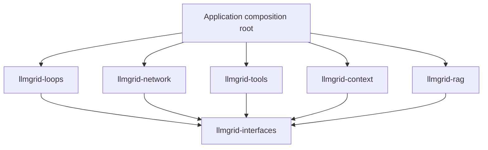

# 3. Packages and repository

[← Back to the plan](../composable-agent-platform-plan.md)

**In short**

- llmgrid is six separately published packages that share one `llmgrid` import namespace, plus a meta-package that installs them all.
- Every package depends on `llmgrid-interfaces` and nothing else from llmgrid. Packages never import each other; only applications combine them.
- Each package owns a clear slice: providers (`network`), tools (`tools`), context and memory (`context`), retrieval (`rag`), and composition and loops (`loops`).

## Repository layout

The project first proposed one distribution with internal subpackages. The owner chose separate distributions instead, so each package can be worked on, versioned, and published on its own (D-02). They share the implicit namespace package `llmgrid` (PEP 420): `pip install llmgrid-tools` provides `import llmgrid.tools`. The `llmgrid` distribution is a meta-package that installs all of them.

What exists today (Phase 0 plus the prototype):

```text
llmgrid/                             # repository: github.com/sanketn26/llmgrid
├── pyproject.toml                   # workspace tool config only (ruff, mypy, pytest); not a distribution
├── requirements-dev.txt             # shared dev tooling
├── Makefile                         # all-package and per-package targets, publishing
├── packages/
│   ├── interfaces/                  # dist llmgrid-interfaces -> llmgrid.interfaces; stdlib only
│   │   ├── pyproject.toml, README.md, LICENSE
│   │   ├── src/llmgrid/interfaces/  # errors, values, model, tools, execution
│   │   └── tests/
│   ├── network/                     # dist llmgrid-network -> llmgrid.network; ChatModel adapters
│   ├── tools/                       # dist llmgrid-tools -> llmgrid.tools
│   ├── context/                     # dist llmgrid-context -> llmgrid.context (planned)
│   ├── rag/                         # dist llmgrid-rag -> llmgrid.rag (planned)
│   ├── loops/                       # dist llmgrid-loops -> llmgrid.loops
│   └── llmgrid/                     # dist llmgrid: meta-package, no code
├── tests/
│   ├── architecture/                # dependency rules between packages
│   ├── integration/                 # offline flows across packages
│   ├── typing/                      # compositions that must fail type checking
│   └── live/                        # opt-in, credentials required (Phase 2)
├── examples/tool_agent/
├── legacy/llm_port/                 # pre-pivot code, reference only; not built or checked
└── docs/
```

No distribution ships `src/llmgrid/__init__.py`; doing so would break the shared namespace. The architecture test checks this.

Where each package is expected to grow. Create a module when its first implementation lands; this shows ownership, not empty files to create now:

```text
network/src/llmgrid/network/   anthropic/, openai/, openai_compat/, gemini/, bedrock/ (later),
                               recovery/ (D-16), capabilities/, serializers/
tools/src/llmgrid/tools/       binding.py, registry.py, errors.py (agent-facing errors), mcp/ (extra),
                               builtins/, workspace/ (git), artifacts.py (read-back tools)
context/src/llmgrid/context/   assembly/, memory/, compaction/, offload/ (ArtifactStore implementations)
rag/src/llmgrid/rag/           retrievers/, evidence.py, grounded_answer.py
loops/src/llmgrid/loops/       composition.py, model_step.py, tool_agent.py, sync.py (D-11),
                               stopping.py, progress.py, verification.py, critic.py, journal.py,
                               subagent.py, experiment.py (Recipe 5)
tests/                         contracts/ (shared conformance suites)
examples/                      grounded_answer/, draft_review/, mcp_agent/, experiment_loop/
```

## Dependency rules



| Package | May depend on |
| --- | --- |
| `llmgrid-interfaces` | The standard library only |
| `llmgrid-network` | Interfaces. `httpx` and provider SDKs are extras: `[anthropic]`, `[openai]`, `[gemini]`, and later `[bedrock]` |
| `llmgrid-tools` | Interfaces. Integration clients are extras, for example `[mcp]` |
| `llmgrid-context` | Interfaces. Storage clients are extras |
| `llmgrid-rag` | Interfaces. Vector-store and embedding clients are extras |
| `llmgrid-loops` | Interfaces only. The application supplies concrete tools, memory, and model adapters |

Rules:

- **Sibling packages never import each other.** Only applications, `examples/`, and `tests/integration` combine them. A package's own tests use fakes built on interfaces.
- A summarizer in `llmgrid.context` accepts a `ChatModel`; it does not construct a provider client.
- Keep the basic `RunContext`, `Step`, and execution error contracts in interfaces, so tools never need to import loops.
- Importing a package must not import an optional SDK. SDK imports happen inside the adapter module that needs them.
- The application's composition root is plain Python constructor calls. No automatic plugin discovery, no decorators that register things as a side effect, no dependency injection container.

**How the rules are enforced.** `tests/architecture/test_dependencies.py` parses every source file and fails if:

- a package imports a sibling or a third-party module,
- a package imports an llmgrid package it does not declare in its `pyproject.toml`, or
- any package ships `llmgrid/__init__.py`.

When the first optional SDK lands, extend the test to allow that SDK only inside its adapter module, or switch to import-linter if the rules outgrow the test.

`make smoke` installs every built wheel into a clean virtualenv and imports each package, proving the published artifacts work without the workspace.

## Versioning

- All packages start at `0.1.0a1` and move together while the contracts are still changing.
- Internal dependencies use a compatible range, for example `llmgrid-interfaces>=0.1.0a1,<0.2`, never an exact pin. A range that includes a prerelease admits prereleases.
- Publish `llmgrid-interfaces` first, then the packages that depend on it, then the `llmgrid` meta-package.
- A breaking change to interfaces bumps the interfaces minor version, and the upper bound in every dependent package, in the same change.
- Once interfaces stabilises, packages may version independently.

## Make targets

| Target | What it covers |
| --- | --- |
| `setup` | One `.venv` with every package installed in editable mode, plus dev tooling |
| `check`, `lint`, `typecheck`, `test`, `build`, `smoke`, `demo` | All packages |
| `check-<pkg>`, `lint-<pkg>`, `typecheck-<pkg>`, `test-<pkg>`, `build-<pkg>` | One package |
| `publish-<pkg>` | Refuses unless on `main` with a clean tree; runs `check-<pkg>`, builds, runs `twine check --strict`, and uploads. `REPOSITORY=testpypi` targets TestPyPI |
| `packages` | Lists the package directories, distribution names, and versions |

## What each package owns

### `llmgrid.interfaces`

Owns the portable value types, capability protocols, execution contracts, and normalized public errors. It also owns trace identity, decision records, the event envelope, and the injectable clock and ID source (D-30).

- Add a contract only when a real consumer needs it.
- Document each protocol's semantics next to it.
- Never include provider names, transport clients, database handles, prompt templates, model catalogues, or recipe implementations.

The full target shape, module by module, is in [Interfaces](04-interfaces.md).

### `llmgrid.network`

Owns provider configuration, SDK lifecycle, serialization, transport retries, normalized model responses, model capability discovery and configuration, and syntactic tool-call recovery.

- Provider-specific schema conversion lives in serializers. The shared `ToolSpec` must not gain a new method every time a provider is added.
- Report actual attempts and usage where available. A request that retried internally must not look like it cost exactly one successful call if that hides known usage.

**Recovery boundary (D-16).** Adapters may:

- extract tool calls that a model wrote as text (marked `origin="recovered"`);
- fix mechanically broken JSON (trailing commas, code fences, single quotes) when the fix is unambiguous;
- normalize provider-specific finish reasons and tool-call shapes.

Adapters must not call the model again to correct arguments, and must not validate arguments against a tool's schema. When arguments are wrong, the call reaches the loop, the tool's decoder rejects it, and the model receives an error result tied to that call. The correction is visible in history and charged to the budget.

If profiling later shows that in-adapter corrective retries are materially better for weak models, reintroduce them only as an explicit, opt-in `Step` in `llmgrid.loops` that reserves budget for every attempt. It must never happen inside `generate`.

#### Provider adapters

The first-party set is fixed (D-21):

| Adapter | Wire format | Covers |
| --- | --- | --- |
| `anthropic` | Anthropic Messages API | Claude on Anthropic's API, and Claude on Bedrock and Vertex through the SDK's platform clients, keeping thinking-block round trips (D-13) |
| `openai` | OpenAI Responses API | OpenAI and Azure OpenAI; carries reasoning items as provider state |
| `openai_compat` | Chat Completions | Hosted providers (Groq, Together, Fireworks, DeepSeek, xAI, Mistral, OpenRouter, and others) and local servers (vLLM, Ollama, LM Studio, llama.cpp, TGI) |
| `gemini` | Gemini API | Gemini on AI Studio and Vertex |
| `bedrock` (planned) | Bedrock Converse API | Non-Claude models on Bedrock (for example Llama, Mistral, Nova), with AWS-native auth, quotas, and guardrails |

**Build order:** Anthropic and OpenAI-compatible first (Phase 2), then OpenAI and Gemini, then Bedrock. The `openai` and `openai_compat` adapters may share serializer code but stay separate, because only the Responses API carries reasoning state.

Every other provider comes through the OpenAI-compatible adapter, or through a community adapter that passes the contract suite.

#### OpenAI-compatible endpoints differ

Endpoints that accept the Chat Completions shape still differ on:

- `tool_choice` and parallel tool calls,
- how tool-call arguments are split across streamed chunks,
- whether usage is reported in streams,
- how accurate finish reasons are,
- `json_schema` response formats,
- non-standard reasoning fields.

So the `openai_compat` adapter takes a **capability profile** per endpoint that declares these facts, defaulting to the conservative value (D-12). When a profile says usage or finish reasons are unreliable, the adapter reports `None` (D-17) rather than guessing. Presets ship for the endpoints the contract suite runs against.

#### Bedrock (planned)

Claude on Bedrock stays on the `anthropic` adapter. The `bedrock` adapter targets the Converse API, whose tool, reasoning, and stop-reason shapes are the same across Bedrock models, so one adapter covers the catalogue. Decide which async client to use before starting (Q-09).

### `llmgrid.tools`

Owns typed tool bindings, the pairing of schema and codec, duplicate-name checks, dispatch, MCP tool sources, and reusable concrete tools. A registry validates and routes a call; the runtime controls ordering, scheduling, and whether a call may proceed.

- Do not build a separate tool-execution engine that competes with the loop runtime. Middleware can wrap the tool executor through the same contract.
- Also owns: validation of declared side effects (D-26); rendering of agent-facing errors, including decoder rejections; restricted executor views for per-step allow-lists; tool-output size limits and the hand-off to an `ArtifactStore`; the read-back tools for offloaded output; and `Workspace` implementations (git first) with protected paths (D-27, D-29).
- The read-back tools depend on the `ArtifactStore` protocol in interfaces, not on `llmgrid.context`.

### `llmgrid.context`

Owns conversation stores, long-term memory implementations, summarizers, and context builders.

- Also owns: `Compactor` implementations and compaction triggers (D-25), and `ArtifactStore` implementations (in-memory and filesystem first).
- A compacted history never separates a tool call from its result or from its provider state.
- A compactor that calls a model receives a `ChatModel` and a `RunContext`, and reserves every call against the ledger.

### `llmgrid.rag`

Owns retrieval: retriever adapters, rerankers, implementations of the `Evidence` type, and the retrieval and citation-validation steps of the grounded-answer recipe.

- It is separate from context because retrieval brings the heaviest optional dependencies (vector stores, embedding clients).
- The `Retriever` protocol itself lives in interfaces, so context builders can accept evidence without importing rag.
- Keep retrieval and generation apart: a retriever returns evidence, a context builder selects and renders it, and a model generates the answer.

### `llmgrid.loops`

Owns composition primitives, run orchestration, lifecycle events, stopping, approval suspension, checkpoints, standard recipes, and the sync facade.

- Also owns: stop-policy built-ins and combinators (D-22), progress signals, the claim-then-verify completion path (D-23), the critic hook and its reserved budget (D-24), sub-agent adaptation and isolation (D-25), the in-memory `ExperimentJournal` (D-28), and the transactional experiment loop (D-29, [Recipe 5](07-recipes-and-patterns.md#recipe-5-critic-supervised-experiment-loop)).
- Prompts, allowed tools, domain output schemas, success criteria, verifiers, progress signals, critic instructions, and protected paths are application inputs or injected policies.
- Never add branches such as `if use_case == "support"` to the runtime.
