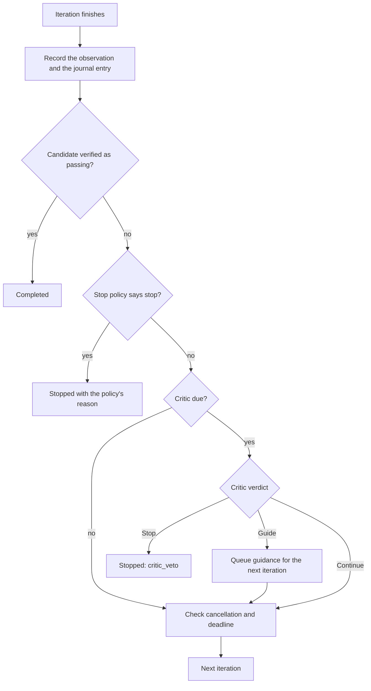
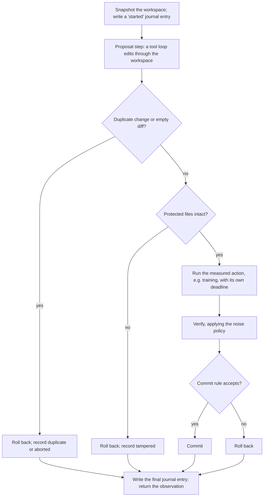

# 6. Loop control

[← Back to the plan](../composable-agent-platform-plan.md)

**In short**

- Real agents are loops inside loops. Each level has its own stop rules and its own share of the budget.
- **Stopping:** the application chooses when a loop stops (iteration caps, no-progress checks, a critic). Budgets and deadlines always apply and cannot be switched off. Every stop has a named reason.
- **Completing:** only a verifier can declare success. The model saying "done" just triggers a check.
- **Staying honest:** the evaluator is out of the agent's reach, noisy measurements are handled explicitly, every attempt is journalled, and every iteration either commits a verified change or rolls back completely.
- **Staying focused:** long histories are compacted or reset, large outputs are moved out of the context, and sub-agents hand back results, not transcripts.

The exact types used here are in [Interfaces](04-interfaces.md#loop-control). The decisions behind them are D-22 to D-29 in [Decisions](02-decisions.md#loop-control).

## Loops inside loops

A real agent is usually several loops nested inside each other. [Recipe 5](07-recipes-and-patterns.md#recipe-5-critic-supervised-experiment-loop) has three:

```text
Critic loop        supervision    Is this worth continuing? Should the inner loop change direction?
  Experiment loop  optimisation   Did this change improve the verified metric? Commit or roll back.
    Tool loop      agent          Read the code and propose an edit, using tool calls.
```

Rules at every level:

- **Each level is a `Repeat`** with its own `StopPolicy`, its own child `RunContext` (with narrowed limits and deadline), and its own stop reasons.
- **An inner level's `Stopped` outcome is data for the level above, not an exception.** The outer level decides what it means. For example, a proposal step that ran out of tool rounds becomes a rolled-back iteration, not the end of the whole experiment.
- **Budgets are handed out top-down.** A level that needs guaranteed budget (the critic, a final verification) sets it aside before starting the level below ([Budget for nested loops](#budget-for-nested-loops)).
- **Only leaf calls open timeout scopes** ([Runtime](05-runtime.md#deadlines)). A 5-minute training run is a leaf call with its own deadline inside the iteration's scope.

After every iteration the runtime records an `IterationObservation`: what was called, what failed, whether the workspace changed, what verification said, whether the change was committed, and whether the model claimed to be done. Stop policies, progress signals, and the critic all read observations, never the raw transcript.

## What happens at the end of each iteration



In words:

1. Record the observation, and append the journal entry if the level has a journal.
2. If the iteration produced a candidate for completion (a verified result, or a model claim that triggered verification) and the verifier passed, return `Completed`. A goal reached on the last permitted iteration still completes.
3. Check the level's `StopPolicy`. If it says stop, return `Stopped` with its reason.
4. If the critic is due, run it. `Stop` returns `Stopped(critic_veto)`; `Guide` queues feedback for the next iteration.
5. Check cancellation and the deadline with `RunContext.check()`, then start the next iteration.

## Stopping (D-22)

A `StopPolicy` looks at the history of observations and returns `Continue` or `Stop(reason, detail)`. `any_of(p1, p2, ...)` combines policies: the first `Stop` wins and its reason is kept.

| Built-in policy | Stops when | Reason |
| --- | --- | --- |
| `MaxIterations(n)` | `n` iterations of this level have completed | `max_iterations` |
| `NoProgress(signal, patience)` | `signal` reports no progress for `patience` iterations in a row | `no_progress`, with the signal's name and detail |
| `MaxConsecutiveFailures(k)` | `k` iterations in a row ended `aborted` or failed verification | `repeated_failure` |
| `StopOnClaim(require_verified=True)` | Only used when there is no verifier: the model claims completion. The result is `Stopped`, never `Completed` (D-23) | `claimed_unverified` |

**Hard limits are not policies.** The ledger (model calls, tool calls, tokens, and cost where it can be enforced) and the deadline interrupt execution at dispatch time, whatever any policy says, with the reasons `budget_exhausted` (naming the counter) and `deadline`. A policy can end a loop earlier; nothing can extend it.

**Stop reasons are a closed set**, so callers can handle every case:

```text
max_iterations | no_progress | repeated_failure | claimed_unverified
| budget_exhausted | deadline | critic_veto | verification_inconclusive
```

Cancellation by the parent is not a stop reason; it propagates as cancellation.

**What `Stopped` carries**, as separate fields: the reason and detail (as a `DecisionRecord`), the level, the number of iterations, the budget used, a reference to the journal, and the best result so far **labelled with its verification status**. A stopped loop may hand back its best verified result, but it never relabels it as `Completed`.

**Every loop must be bounded.** A `Repeat` needs at least one bound: `MaxIterations`, or a ledger limit on the scope it runs in. A `Repeat` with neither fails when it is constructed.

## Detecting no progress

"No progress" means different things at different levels, so it is a pluggable `ProgressSignal`. A signal returns `progressed: True`, `False`, or `None`. `None` means it cannot tell yet (for example, too little history). `NoProgress` counts only `False` readings towards its patience; `None` neither resets nor advances the count.

| Signal | Reports no progress when | Typical level |
| --- | --- | --- |
| `RepeatedCalls(window)` | The same sequence of tool calls (same names and arguments) repeats within the window | Tool loop |
| `RepeatedErrors(window)` | The same tool error codes repeat for the same tool | Tool loop |
| `NoWorkspaceChange(window)` | The workspace did not change for the whole window | Tool loop, experiment loop |
| `RepeatedChange(window)` | A change repeats one already in the journal | Experiment loop |
| `MetricPlateau(patience, min_delta, direction)` | The best verified metric has not improved by at least `min_delta` in `patience` iterations | Experiment loop |
| `StateCycle(window)` | The workspace returns to a state it was in before (oscillation) | Experiment loop |
| `FalseClaims(k)` | The model claimed completion `k` times and verification failed each time | Any level with a verifier |
| `any_signal(...)`, `all_signals(...)` | Combine signals | Any |

Signals read observations and the journal. They never call a model. Model-based judgement of progress is the critic's job.

## Certifying completion (D-23)

A loop is complete only when a verifier says so. Evidence comes in three strengths:

| Strength | Examples | Can it certify on its own? |
| --- | --- | --- |
| `deterministic` | Tests pass; a metric crosses a threshold on protected evaluation data; a schema validates; a build succeeds | Yes |
| `judged` | An independent model with a rubric and a fresh context; a human approval (Phase 6) | Yes, if the application accepts judged certification for that loop. The outcome records that it was judged |
| `self_report` | The working model says it is finished | Only through the built-in `AcceptClaim()` verifier, which the application must configure explicitly. The outcome records `self_report` so callers can tell. Never by default |

Rules:

- **A failed verification feeds back.** Its `feedback` goes to the working model as a visible message, and the loop continues (using up an iteration).
- **`inconclusive` is not `failed`.** A loop that ends on an inconclusive verification stops with `verification_inconclusive`.
- **A judged verifier is independent.** It does not share the working model's context. It receives the candidate and the rubric, and reserves its own calls.
- **"Goal achieved" is auditable.** `Completed` carries the `VerificationResult`: which verifier certified it, and with what evidence.
- **Evaluators and verifiers are different.** An `Evaluator` (Recipe 3) guides revision with feedback; a `Verifier` certifies. A verifier may wrap an evaluator; the reverse is not allowed.

## Protecting the evaluator (D-27)

What measures success must be out of reach of what is being measured.

- The application declares **protected paths** on the `Workspace`: verifier code, evaluation data, metric definitions, the measurement code in the training harness, and the loop configuration itself.
- Every write path the workspace controls rejects protected paths with an agent-facing `protected_path` error.
- Tools that run arbitrary commands (a shell, a training script) can get around path checks. Two more defences apply:
  1. **Hash check.** Before every verification, the verifier compares the protected files' hashes with the baseline recorded when the loop started. A mismatch aborts the iteration, rolls it back, and records a `tampered` journal entry. Two tamper events stop the loop with `repeated_failure`.
  2. **Pristine copy.** Deterministic verifiers run from a copy of the evaluator kept outside the workspace (or from the baseline commit), never from the agent's working tree.
- **Keep a held-out set.** The verifier's reference data should include data the agent never sees in any tool output. The fast verification (for example, 5 minutes of training) is only a proxy; a slower held-out verification runs on each commit or every `k` commits. When the proxy and held-out results diverge, that is reported to the critic as a sign of overfitting to the proxy.

## Noisy measurements

Short runs give noisy metrics. Without a noise policy, a loop commits noise, the critic sees progress that is not real, and `MetricPlateau` never fires.

- Declare `min_delta`: the smallest improvement that counts.
- Measure the noise floor when the loop starts by repeating the baseline measurement (default three runs), and record it in the journal.
- A candidate whose improvement is within twice the noise floor is measured again (default up to three samples) before deciding.
- Commit only when `mean(candidate) - mean(best)` exceeds `max(min_delta, 2 × standard error)` in the declared direction (Q-10).
- Re-measure the current best from time to time, so one lucky sample does not block every later candidate.
- Every sample counts against the budget and the iteration's deadline. Handling noise is budgeted, not free.

## The loop critic (D-24)

The critic reviews the loop's trajectory (its observations, the journal, and the metric history) against the application's goal, and returns `Continue`, `Guide(feedback)`, or `Stop(reason)`.

1. **Its verdict binds.** `Stop` ends the level the critic supervises, whatever the inner model wants. The inner loop cannot resume a loop the critic stopped.
2. **Its budget is set aside first.** Before the inner loop starts, the runtime creates the critic's scope from the parent's remaining limits (default: 10% of model calls and tokens, and at least enough for two reviews) and caps the inner loop at what remains. The ledger rules already guarantee this: the inner scope cannot exceed its cap, so the reserve stays untouched.
3. **Its guidance is visible.** `Guide(feedback)` becomes a message, marked as critic guidance, at the start of the inner loop's next iteration, and is recorded in history and events. It is never slipped silently into the instructions. Feedback length is capped (default 1,500 characters), and so is the number of guidance messages kept in context; older ones are folded into the journal.
4. **It is independent.** The critic has a fresh context, reads observations and the journal rather than the inner transcript, may use a different model, and has no write tools. A critic that reads the same context with the same model shares the inner loop's blind spots.
5. **Cheap checks run first.** Deterministic stop policies run every iteration. The model-backed critic runs on a cadence: every `n` iterations, plus on triggers (`k` rollbacks in a row, a metric regression, tampering, divergence between the proxy and held-out results, a repeated false claim). A final review when the loop stops is optional and produces a summary, not a verdict.
6. **It is bounded.** When its reserve runs out, the critic stops reviewing and the deterministic policies carry on alone. This is recorded as an event.
7. **Its failures are handled.** A failed critic call (a provider error) is recorded. After one failure the loop continues on the deterministic policies. After two in a row it stops with `critic_veto` and detail `critic_unavailable`, unless the application chose to fail open (Q-11).

The deterministic `StopPolicy` is the cheap critic; the model-backed `Critic` is the expensive one. Both plug into the same point at the end of each iteration.

## Budget for nested loops

```text
run scope (the whole task)
├── critic reserve           set aside first (D-24)
├── final verification       set aside first, when the loop must verify its best result at the end
└── experiment loop scope    = what remains
    └── per-iteration scope    a cap per iteration, so one iteration cannot use up the loop
        ├── proposal (tool loop)   capped model calls and tool rounds
        ├── training run           a leaf call with a 5-minute deadline
        └── verification           samples × a per-sample cap
```

- Per-iteration caps are the defence against one runaway proposal consuming the whole experiment.
- A child's unused allowance is not handed to its siblings; it stays in the parent and is available to later iterations.
- Deadlines follow the same shape: the inner loop's deadline is the parent's, minus the time reserved for the critic and the final verification.

## The experiment journal (D-28)

The journal is an append-only record of every attempt: its hypothesis, the change it made, its verification, and whether it was committed or rolled back, and why.

- **It is not conversation history and is never compacted.** Compaction may drop turns; it re-injects the current journal view instead.
- **The proposal step sees it**, so the model knows what has been tried, what worked, and what failed.
- **Duplicates are rejected before running.** A proposal whose change is already in the journal is rejected (status `duplicate`) before any training time is spent. This does not catch changes that are equivalent but produce different diffs; the critic is the defence there.
- **Code writes the entries.** The model's `hypothesis` and `reflection` are recorded as untrusted text and never used for a decision. Whether to ask for a `reflection` at all, and how many to show later attempts, is the application's choice.
- **A `started` entry is written before the run**, with the snapshot ID, so a crash can be resolved on resume ([Transactional iterations](#transactional-iterations)).
- **It has its own store**, referenced from checkpoints rather than embedded in them (Q-15).

## Transactional iterations

(D-29.) An iteration that changes a workspace either commits a change the commit rule accepts, or rolls back and leaves no trace.



Step by step:

1. Take a snapshot and write a `started` journal entry.
2. Run the proposal step: a tool loop whose write tools go through the workspace.
3. Reject duplicates (using the journal) and abort if the diff is empty.
4. Check the protected files' integrity against the baseline; on a mismatch, abort and roll back (D-27).
5. Run the measured action (for example, training) as a leaf call with its own deadline.
6. Verify, applying the noise policy.
7. Decide **in code** with the configured `CommitRule`: commit if it accepts, otherwise roll back.
8. Write the final journal entry and return the observation.

**Commit rules.** The application picks one, or writes its own:

| Rule | Commits when | Suits |
| --- | --- | --- |
| `improves(direction, noise)` | The verified metric beats the best so far by the noise policy's threshold | Optimisation loops (Recipe 5) |
| `no_regression()` | The diff is not empty and the verifier still passes (for example, the protected test suite is green) | Building something up step by step, where most useful steps move no metric (the Ralph loop) |
| `all_of(...)` | Every listed rule commits | For example, no regression plus a lint check |

Rules:

- **The model proposes; it never decides whether to commit.** There is no "commit" tool in the proposal step's allow-list.
- **Any failure rolls back.** A failure anywhere between steps 2 and 7 (a tool error that ends the proposal, a training crash, a timeout, a verifier error) rolls back to the snapshot. Between iterations, the workspace is always at the last accepted state.
- **No side effects that rollback cannot undo.** Only `read_only` tools and writes inside the workspace are allowed in a transactional iteration. A tool with an external effect (a push, a database write, an API call), whether idempotent or not, is rejected when the iteration is constructed, because rollback cannot undo it. Such effects belong outside the loop, behind approval (Phase 6).
- **The measured action must be cancellable.** If it runs as a subprocess, cancellation kills it. An action running in a thread that cannot be stopped is documented as such ([Runtime](05-runtime.md#approval-and-durable-side-effects-later-milestone)). A remote job needs its ID recorded before dispatch so a resume can reconcile it.
- **Resume.** On restart, a trailing `started` entry with no decision means the iteration was interrupted: roll back to its snapshot, record `aborted`, and continue from the last commit. Committed iterations are never repeated.

## Keeping context clean (D-25)

### Compaction

- **Trigger.** Before each model call, the context builder estimates the input size with an injected estimator of documented accuracy. Above the trigger (default 70% of the model's declared input window, Q-12) it compacts down to the target (default 40%).
- **Paid for.** A summarising compactor makes a model call, reserved against the ledger. A purely mechanical compactor (drop old tool outputs, keep their handles) costs nothing and runs first.
- **What is always kept:** pinned messages (instructions, the task statement, critic guidance still in force), the most recent `k` turns, every tool call together with its result and the assistant message's provider state (never separated), and the current journal view (re-injected, not summarised).
- **Order.** First replace old tool outputs with their artifact handles; then drop the oldest unpinned turns, whole call-and-result units at a time; then summarise what was dropped.
- **Failure.** If the pinned content alone exceeds the target, compaction fails with `ContextLengthError`. It never truncates silently.
- Dropping messages drops their provider state too. Adapter documentation says what that costs (for example, loss of earlier reasoning continuity).

### Offloading

- Every tool has an output limit (default 8,000 characters, configurable per tool). Output over the limit goes to the `ArtifactStore`, and the model sees a handle instead: `[artifact art_7f3: 48,213 chars, text/plain — first 40 lines below; use read_artifact or search_artifact]`.
- `read_artifact(ref, offset, limit)` and `search_artifact(ref, pattern, max_matches)` are ordinary `read_only` tools in `llmgrid.tools`, added to a step's allow-list when offloading is on.
- Offloading is visible to the model and recorded in events. It is a size policy, not hidden truncation.
- Plans and notes the agent wants to keep across compaction belong in the journal (for iterative loops) or in an explicit notes tool backed by the artifact store, not in ever-growing history.

### Choosing what each iteration starts with

Each `Repeat` declares a context strategy:

| Strategy | Each iteration starts with | Memory lives in | Trade-off |
| --- | --- | --- | --- |
| `carry` | The previous iteration's history | History | Simple, but grows until it hits a limit |
| `compact` | The previous history, compacted when over the trigger | History plus compaction summaries | Keeps continuity, but summaries can drift |
| `reset` | Only pinned content, the task, and the current journal view; the workspace holds everything else | The workspace and the journal | No summary drift and fully inspectable state, but each iteration pays to re-read what it needs |

The library has no preferred strategy; the application picks one per level. `reset` combined with sub-agents is the Ralph loop.

### Sub-agents

- A sub-agent is a recipe run as a `Step` with a child `RunContext`: narrowed limits and deadline, its own history, its own tool allow-list, and its own stop policy.
- **It returns a typed result, never its transcript.** The parent's history contains only the call and the result. The sub-agent's transcript goes to events (and optionally the artifact store) for debugging.
- `AgentTool` turns a sub-agent into a `Tool` so a model can delegate to it. Its declared effect is the strongest effect among the sub-agent's tools.
- When a sub-agent called as a tool ends `Stopped`, the parent model receives an agent-facing error result with the stop reason and the best verified partial result, if any. When it is composed as a step, the `Stopped` outcome is passed up as data (Q-16).
- Sub-agents inherit the parent's cancellation and cannot exceed the parent's remaining limits.
